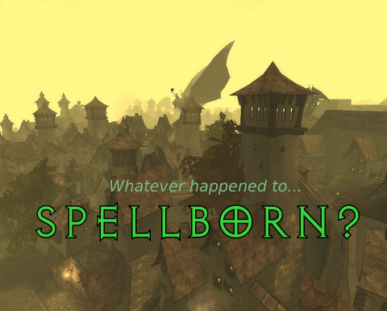
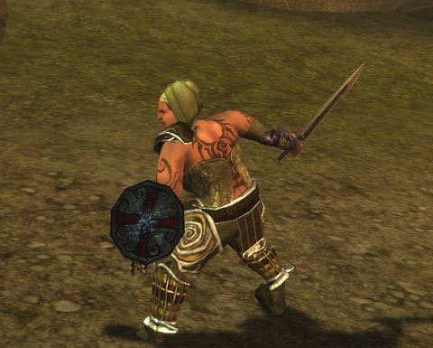

Back to: [West Karana](/posts/westkarana.md) > [2008](/posts/2008/westkarana.md) > [December](./westkarana.md)
# Did you ever get around to installing Spellborn?

*Posted by Tipa on 2008-12-30 02:36:23*

Kinda ragged... spent all night backing up my blog, then I decided to make the new blog really snazzy, then I REALLY fouled things up so that I couldn't get email any more, and don't even ASK me how that happened, because I SWEAR I don't know...

I was thinking of sleep, when I thought, hey, company is gone, I have the use of my computer back, maybe I could install Spellborn and, you know, PLAY IT?

I could and did indeed. After about an hour and a half of patching, anyway.

When I mentioned in an article I wrote for Massively awhile back that you could make overweight characters in Spellborn, a commenter said, 'Gee, great, a game for lesbians.'

That was kinda mean! And anyway, chubby can be cute!

So here is my human rogue, with a few extra pounds, but she can work them off adventuring! She sure can!

Way too tired to write more about the game. I will note that the game world may be gorgeous, but all you are seeing is that tiny little reticule. It knows all, sees all, guides all.

My character's name is Tipa, and she is on the International PvE server.

