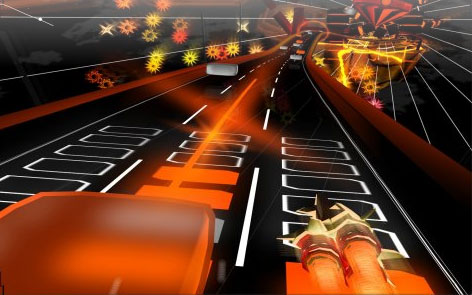

# Audiosurf: When we say play your music, we mean it.

*Posted by Tipa on 2008-02-20 03:15:40*

When I listen to music, and close my eyes, I see blocks whizzing at me at the speed of sound.

It didn't used to be that way. Audiosurf did that.

I have over three thousand eight hundred and eight songs ripped and on my computer. That's nearly four thousand ways Audiosurf can rip my mind apart. Each game is generated from the music. Quiet bits have few blocks. Turn up the energy a little, and low scoring blue blocks flood down. Turn it up a notch more, and it's a blizzard of blue, with occasional streaks of yellow and red and MAN.... You are FEELING the music.

Here, watch the Oyster Boys prophesy doom in "The Old Gods Return" while I try to save the day by collecting blocks:

The game is basically all about matching colored bricks by hitting them with your space ship. You can race with lots of different drivers, and each has a different style of game play. I'm running on one of the easy modes here, not doing so hot, but that's fine because my mind is as wide-eyed as if I'd just chugged a six pack of Mountain Dew.

I wish the tracks tracked the songs more closely. I tried a bunch. The best was Love Spiral Downwards' "By Your Side", a nice down tempo song. Tracks like BOC's "[Stairway to the Stars](http://youtube.com/watch?v=sA1K5NGAKEs)" -- not so much. "O Fortuna", that chorale piece you see a lot in horror movies -- I expected great things, but no. Ozric Tentacles' "Dissolution", a song I was listening to at work and thought -- "This song would be AMAZING on Audiosurf" -- but it really wasn't. Synergy's "Revolt at L-5"... did not do it for me.

So little Audiosurf secret here -- dense walls of music will not make an exciting track. I clean song with a distinct beat and melody -- that's gonna give you the race of your lifetime.

Well, I guess I've got about 3,780 more songs to go so I better get to it.

