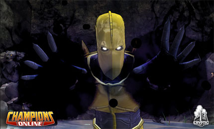
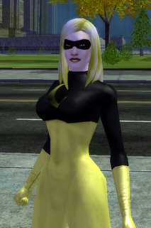
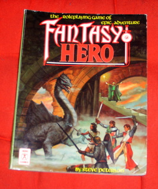

Back to: [West Karana](/posts/westkarana.md) > [2008](/posts/2008/westkarana.md) > [February](./westkarana.md)
# Why Champions Online may be the most innovative MMO of 2009.

*Posted by Tipa on 2008-02-21 12:41:29*

  
*Dr. Destroyer in Champions Online*

[Champions Online](http://champions-online.com) is the new game from the developers of City of Heroes and the defunct Marvel Universe Online. When I first heard the name of their new game (and anyone who doesn't believe we're seeing the essence of what Marvel Universe Online would have looked like can just rest easy in their wrongness), I immediately slipped back twenty years to one of my favorite pencil and paper RPG campaigns ever.

Champions laughed at Dungeon's and Dragons' character creation. Roll DICE? Take a chance with your character? Heck, everyone I knew basically just made up their own stats, even if they had to reroll a dozen times to get them. In the end, we just had a point total for our new characters and we set their stats how we liked them.

In D&D, that was cheating. In Champions, that was the GAME.

  
*Moonmist in City of Heroes*

Levels? Who needs them? We had powers -- we could make our own powers. One of my favorite characters was Moonmist, who could bend light and darkness to create illusions and misdirect; her power waxed and waned with the phase of the moon, were most powerful at night. She didn't need to kill people. She could use illusions to lead people to bad ends, if need be.

See how it went? Her powers had disadvantages -- and you could use those to make your powers more formidable. The powers were based on criteria that I made up. And Moonmist, and the others in her super group, solved crimes and battled villains in their own way, and they didn't answer to NOBODY. I remember my team-mate Doctor Tachyon, who had the power of probability -- he could choose from a selection of possible near futures to pick the best one for him -- for instance, to dodge a gunshot -- and also had a short-range quantum teleportation. You didn't play dice with Dr. Tachyon. And there was no point in locking your door to him, either.

These are the things we had in Champions. We didn't have to level up to get these powers. Just like in the comics, we had them from Day 1. As we completed missions, we could earn points to increase our powers or remove disadvantages (to make it possible for Moonmist to use her powers on moonless days at high noon, for instance, though she never did completely earn out that disadvantage if I remember right).

When I recreated her in City of Heroes, I was able to get her costume close to how I remembered it, but her powers were limited to those any illusion controller might have -- illusory wounds and some light-based crowd control. Those are good, useful powers, but so common and don't particularly reflect any sort of creativity on my part.

  
*Fantasy Hero, another Hero Systems ruleset*

I couldn't find my Champions book on the spur of the moment, but I did dig up my old Fantasy Hero book. It was buried in with all the comics I used to read back then. I was way more interesting when I was younger.

After Champions, I turned to writing and running my own games, which I ran via email over the Internet as it existed in the mid-80s. The company I worked for, Digital Research, would phone up our link, Amdahl, a couple of times a day, and we'd get our email and news all in one lump. I called my game Timespan, and it was based on Michael Reaves' "Shattered World" books, using the Fantasy Hero rules. I later moved it all to CompuServe and PeopleLink, and by the time I finished, it was three years later and five campaigns of ever increasing size and scope. (If you were a Timespan player, LET ME KNOW!!!)

All Hero Systems games, since they used the same rule set, could work together. So I could take a character from a Champions campaign and bring them (somehow) to a Fantasy Hero campaign and they would fit right in. Or take them both and put them in one of those super spy campaigns. The spies might wonder what those heroes and wizards were doing, but they could fight one another, team up or whatever.

So imagine if Cryptic is successful with Champions Online. It has an amazing character creator, a power builder that is based on a genre-independent rule set -- and then they decide to make a follow-up fantasy MMO, based around the same engine.

And the same characters, because, they all have the same character generator at the core.

Now take this a step further. Let's say they just release the character creator, alone, and allow them to be used in people's OWN CAMPAIGNS. So, you make your SuperWallBuster Guy, and team up with some friends, and then you all group up and come to a world Joe IndependentDesigner created, adventure there for awhile, have fun. Another friend is playing in a Wild West world, and wants to come along. NO PROBLEM. Your next adventure finds you on a floating space hulk, find your way out before the aliens prowling the corridors get ya.

Given a fantastic character creation system, and a rule set that allows play in different genres, AND the ability to have a rival/arch-villain around to make things interesting, and add some sort of adventure creation system... and you have just made my dream game. THAT'S the one I want to play.

And version 1.0 of it is coming out next year... okay. That's it. That's the game that could get me to switch. City of Heroes was too repetitious and didn't let me make unique characters (though they looked unique... they weren't).

Cryptic, I already love your game and all I have are screenshots and memories of a game I enjoyed more than even D&D. I want to be a part of your game. Call me, write me.... :)

## Comments!
---
**Hexx** writes: As a kid, I played the old Marvel Super Heroes RPG, the DC Heroes RPG, Champions, and GURPS Supers.

Marvel was the best for playing with characters you already knew and loved... playing as Longshot or Wolverine or Spiderman was fun. But It got old fast.

DC never grabbed me, the ruleset didn't work.

GURPS Supers had all of the advantages and disadvantages of being GURPS. 

Champions, though? Amazing character creation, fistfull of dice combat, fast and furious action, your characters are yours, and so they can grow and change without trying to follow canon of some existing Ip...

I loved Champions. I refuse to get too excited over Champions Online... if it crashes and burns, I don't want to be disappointed. But it could be the game that I really wanted Freedom Force or CoH to be.
---
**JoBildo** writes: TOTALLY agree about the mission creatio system. If it's not in at launch I'd be okay with that, but taking the Arch-Nemesis one step further and letting players create their own scenarios a la Ryzom-Ring would be ideal.

Thanks for checking out my post and commenting, Tipa. Looks like we both have a game to be waiting for now.

I call dibs on the name "The Amazing Bildo".

Here's hoping we both score spots in the beta to help push and prod them in the right direction, eh?
---
**Tipa** writes: @Bildo - Well, something we can agree on, anyway :P

@Hexx - I played GURPS cyberpunk, mostly because of all the free publicity given it by the Secret Service, but didn't really get into the system, similar though it was. I've considered the Hero system the absolute best and most creative character generation system ever. Ya know, I don't even remember how combat was handled. It's all about the characters and the weapons you could make.
---
**Hudson** writes: How quickly we all drink the Kool Aid.

A flashy website and suddenly praises everywhere! I remember the same reaction when Horizons was announced :(
---
**Tipa** writes: Well, the Horizons hype was pretty easy to see through. There was absolute no way they could implement a fraction of what they promised, and about a year into the development when all they had were a couple of animations of someone walking, I abandoned hope for the game.

I haven't bought into the hype. My post is all about how much I enjoyed Champions way back when, and how what they plan fits into my conception of a perfect game. Plus, they've actually made a real MMO that I currently have an active subscription to, that includes a character generator that is the only reason I subscribe to the game.

Bildo has generous doses of reality listed on his blog. I know they won't allow the sort of freeform character generation that you get with the PnP game. They can't. I know there won't be player content -- they would have mentioned that. But the stuff they are definitely providing will definitely get me off of CoH, and there's no doubt about that at all. They can take CoH's character generation, already the best, make it better, AND ALSO add a game to it... well, that's a dream come true.

I've played more MMOs than just WoW, I know what they're like... and I am looking forward to this one.
---
**JoBildo** writes: I'm prone to fall for hype still, idealist as I am... but I also know bullsh*t when I see it.

The GI article isn't that. That website's feature-list isn't that. What we know so far, I fully believe Cryptic is capable of. They eventuall made CoH into one of those games that really left a mark on the genre, even with its faults... which they were aware of the whole time but didn't have the foresight to stem before it was too late to change things.

Given that this is their second go-round... I fully expect everything that's in the magazine and on the site to come to fruition, and then some. Maybe Hud's right and I'll be disappointed. I have before. But for now, I'm willing to believe in Emmert and crew's promises, because I have no reason to distrust them yet.

Now if the class system they talk of now (with all powers for all classes at different costs) becomes a basic class system like in CoH... then I'll start to worry we're just getting CoH in a new wrapper. Until then, I'm happy to believe we're getting the game CoH always should have been, and the game Cryptic always wanted to make from the start.
