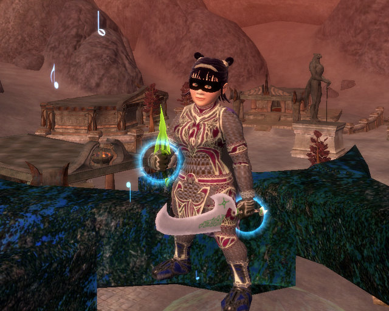
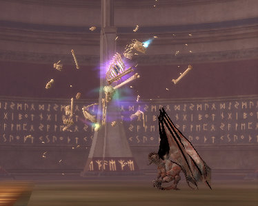

Back to: [West Karana](/posts/westkarana.md) > [2008](/posts/2008/westkarana.md) > [January](./westkarana.md)
# EQ2: Not bad for an off night.

*Posted by Tipa on 2008-01-10 08:45:23*

Last night was an off night -- no official raiding -- but when I got a raid invite the moment I logged in, well, who am I to say no?

Severilous was up, the Epic x2 dragon in the Kunzar Jungle I'd killed before playing Dera. What took a half dozen pulls and two full groups in Eternal Chaos took a group and a half and just two pulls with Clan of Shadows. Nice! I think some of the people in the raid were alts, too.

Why stop there? We moved to the Tunarian Throne Room, and got quite far in there until some random screwup messed up the timers and we faced starting over or doing something else. We got word that the Pumpkin Headed Horseman was up. The old EC raid leader, Madcap, was in our TTR raid to fill it out, and volunteered to come with us to kill PHH. We never killed him while we were both in EC, and I think that failure was one of the reasons he quit. So he had a score to settle, and I think it was paid off when we burned him down before he even had a chance to summon his first set of exploding pumpkins.

It *is* easier when everyone is 80...

That finished our official OFF night raiding. I joined a guild Maiden's group, and we just tore through the place. Record time. It is SO DIFFERENT from the pickup groups I've had before. Drusella? She went DOWN. I pulled two upgrades out of that place -- the picture at the top isn't appearance armor; that's actually what Dina wears. It matches enough now that I can drop the appearance stuff.

Danak shipyards has the armorcrafter who makes the new relic armor from Veeshan's Peak. That stuff is SO NICE. I don't like the mustard yellow look so much. but the stats are amazing. I guess we'll need armor like that to survive in VP, so I expect us to be faming relic armor in VP for some time before we take on Trakanon in his lair.

(I always pronounce that TRAK-a-non. But I wonder.... tra-KAN-in sounds cooler...)

We went from there to the Vault of Eternal Sleep -- another quck run, and yet another upgrade; bracers made for bards, and they replaced some fabled EoF bracers

The Fabled are still better in some ways, but the RoK armor shines in its extra effects. I think it's fair to say that if you do a LOT of RoK instances, you will upgrade much of your EoF raid gear eventually, but the stuff lasted nearly two months so I wouldn't say you would upgrade all your stuff in KP stepping off the boat, as some have claimed.

Blogger channel was jumping last night, with Stargrace on her fifty million characters, Ogrebears and his rat, and new blogger Taymar saying hello :) As well as someone else I didn't recognize. But that's EQ2 for you -- fun in game, fun chatting with friends. Maybe it's something that only happens after three or more years, but I think EQ2 is finally forming a strong community with a sense of history. 

I wonder if WoW is?

