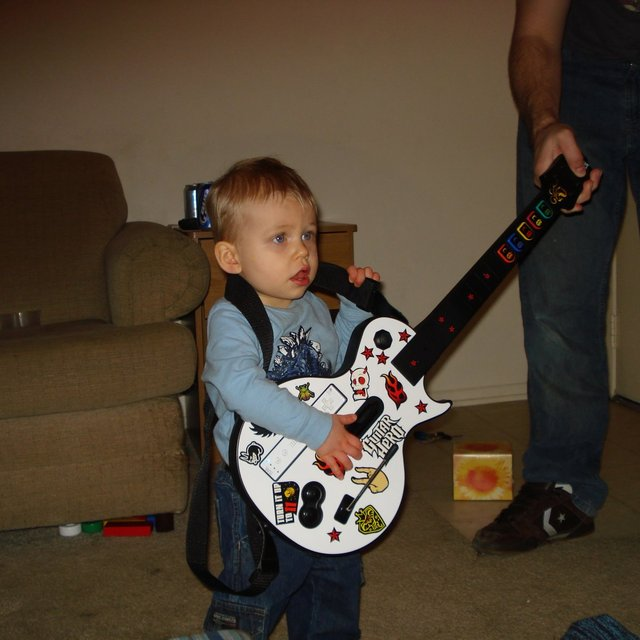

# Rock Band: Real PvP vs Carebear PvP

*Posted by Tipa on 2008-01-24 15:11:37*

There's a lot of discussion about PvP in upcoming MMOs. How hardcore will it be, will it interest non-PvPers... It can. If the penalty for losing is not that great, I feel people will embrace it. By slowly removing the PvE experience as you level, as Warhammer is said to be contemplating, you end up in PvP quite naturally. That's certainly how I went from a PvE EQ1 player to a RvR DAoC player.

Most popular games in history have been PvP -- team sports are nearly all that way; board games are all like that; card games... games can be a certain amount of fun by themselves, but add someone else across the field or across the table and it becomes a true experience.

Guitar Hero is a fun single player game. It got a lot more fun when Genj and I were dueling last time she was up -- her on Medium and me on Expert, so we were evenly matched. Actually, I think she won... but I was trying a lot harder to play well than if I had just been going through the game by myself.

PvP makes you *want* to play better.

Rock Band is a fun cooperative game -- you and three friends make a band and play songs together. But it gets a lot more fun when you challenge people online. Sure, you're the top dawg in your living room... but you're a small puppy in the pound.

Last weekend, I terrified noobs by completely destroying them in the Tug of War duels on drums. One guy -- "choke u" -- sent me terrified messages afterward begging me to go play Hard duels instead of sitting around camping him on Medium. Well, I can't play all songs on Hard, that's why. Anyway, "choke u" is one of the Motorcycle Fotographers that quit when they're losing to protect their ranking. So who cares what he thinks. And besides, with his low rank, he's not swimming with the sharks that lurk in the deep, dark corners.

Tug of War is strategic, in the sense that every few bars the other person plays; sometimes you play together but mostly, you have a few seconds to watch their play, get a sense for how you should use (or save) your Overdrive. For instance, if the other player just started a long roll, you can see, for example, if they can even DO long rolls -- noob players don't have the precision. And if they do do them, well, at least you know that's an excellent time for an Overdrive, since you get max points for them AND long rolls usually include another Overdrive to extend it even further.

That sort of thing. It's kind of a bloodless PvP, aside from the huge damage to your rank if you lose.

Last night, I decided to go really hardcore and do Score Duel -- both players play the whole song through, you can't really see what the other player is doing, it's like a 100m dash compared to a relay race.

I was lucky to get some casual duelists to start that let me break my habit of watching the other player before losing could damage my new rank. I was between rank 0 and 1 for at least four songs.

Then came Metallica's "Blackened". This is a DLC content -- we both had to have bought it for it to appear as an option. So I was dealing with a real rocker. Blackened has long sections of quartets where it goes 'snare-kick-snare-rest' mixed in with 'snare-(kick+tom)-snare-rest', and it does so very fast.

I'd played Blackened before, but never in a duel, so I'd forgotten about them. Usually it's not a problem, I learn the new pattern and then I'm fine. This time, it was like being neck and neck with another runner -- and then tripping. He zoomed ahead. I came close, but never caught up after that -- whereas I might have been able to in Tug of War with good Overdrive control.

Things went well until Deep Purple's "Highway Star" -- a song I'm usually pretty good at, since it is Jazz's favorite (and also the song that opens the game). This is a song that is pretty easy, except where it's not. There's one spot, easy to miss, where they syncopate the snare for ONE beat. And they have BUNCHES of of grace notes followed by a kick+cymbal hit which take really good timing (they often have four or more in a row) and often contain an Overdrive as well. So it's IMPORTANT to take those.

Every song has a different strategy, with its own high and low points and zones of control. Of course, playing perfectly would be a pretty good offense, but even the best players make mistakes.

I do love the PvP, and I'm working up to playing on Hard mode -- playing the real demons. Medium is about as far as you can go without some sort of special affinity for the drums. After that, you're beginning to play for real -- a totally new world. Real drummers syncopate EVERYTHING, drop out drums randomly, never kick once where two would do.

I'm going to be severely beaten when I get there. But I'll probably, perversely, enjoy it. And I'll wallop some other newbie later on.

That's the whole PvP thing, right?

One difference, one really important difference, between this and MMO PvP: in Rock Band, everyone has the same gear. The only thing that separates you from the other player is skill. You can't fake it. You can't get around it. You *can* use strategy to get around it, but that is another part of skill. MMOs only get you to keep playing because they promise that good enough gear means you can get by without as much skill.

This is what confuses me about MMO PvP. The *real* PvPers play shooters or real-time strategy games; they know the names of their opponents and they win or lose on their own skill. I just can't see how grinding levels for gear so skill doesn't matter even qualifies. What the heck is PvP even doing on MMOs?

It's pretty broken on EQ2 and WoW -- gear and levels trumps skill -- and since WAR has both gear and levels, I guess it will have the same crutches. The last thing a MMO PvPer wants, is a fair fight. If they were all about both sides being equal and winning on skill alone -- they'd go play Halo or something.

MMO PvP is therefore a niche, only a shadow of the real thing. All the real PvP has moved to other genres.
