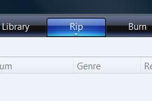

# Amazon will help you violate copyrights... for a price.

*Posted by Tipa on 2008-01-31 08:31:24*

> As someone who has purchased music at Amazon.com, you might be interested in turning those CDs into MP3s. Rather than spend your valuable time ripping your CDs, let Riptopia do the work for you.

Just send your CDs to Riptopia via padded/protected, prepaid, and insured spindles. In a few days, Riptopia will return your new digital music library on data DVDs along with your original CDs. You're now ready to enjoy your perfectly portable, easily sortable digital music library for loading onto your iPod, computer, or music phone.

Leaving aside the fact that the music I most recently bought from Amazon, I bought as MP3s... and the observation that it takes about five minutes to rip a CD for free these days, is this even *legal*?

The RIAA claims that ripping your own CDs to MP3s for your own personal use [is illegal](http://www.switched.com/2007/12/11/riaa-claims-ripping-cds-for-personal-use-is-illegal/). And remember back in 2000, MP3.com offered essentially the same service -- giving you the MP3s of the songs you owned -- and was [sued into oblivion for it](http://en.wikipedia.org/wiki/UMG_v._MP3.com).

While you ripping your own CDs for your own personal use [may be legal](http://en.wikipedia.org/wiki/Sony_Corp._of_America_v._Universal_City_Studios%2C_Inc.), it's easy to think of a future where the US government at the behest of the RIAA subpoenas the names and addresses of every Riptopia customer. At $9000 per track and lots of 100-200 CDs, an average use of this service could run you 9 million dollars in fines when they take you to court.

Guess I'll just rip my own CDs, thanks. The music companies have way too much influence with the government to make something like this at all safe to use.

