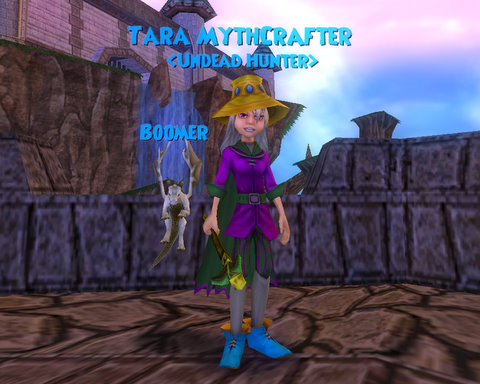

Back to: [West Karana](/posts/westkarana.md) > [2008](/posts/2008/westkarana.md) > [July](./westkarana.md)
# The new Wizardling...

*Posted by Tipa on 2008-07-10 05:52:21*

It's not the "perfect" MMO, but it's definitely different enough to make it worth a look. Deck-building, strategic card-playing, turn-based combat? Check. Automatic grouping? Check. An absolutely INSANE amount of character customization? Check. A Toon Town-ish gameplay style that lets kids and adults play safely together? Check. Friggin' baby dragon pets? Oh dear, yes, check!

I'm working on a big article about this game, but you should probably [check out the beta](https://www.wizard101.com/)... Tara Mythcrafter, level 7 Myth wizard, look me up :)

