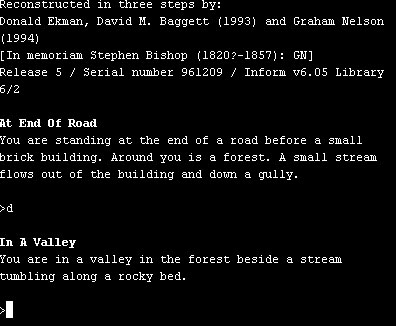
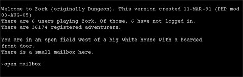
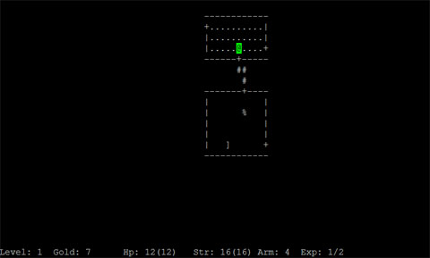
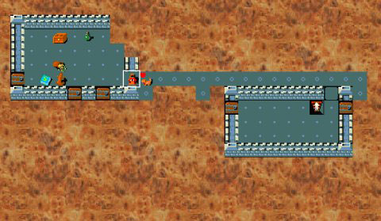
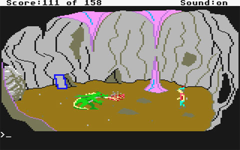
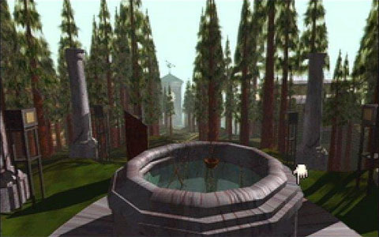
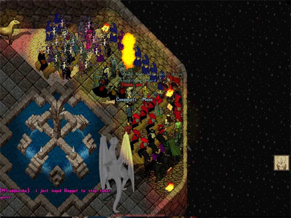
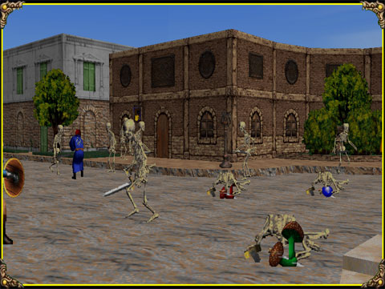
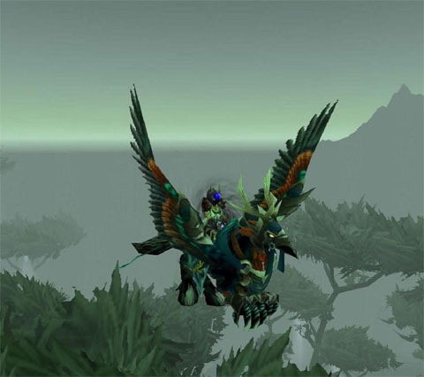

Back to: [West Karana](/posts/westkarana.md) > [2008](/posts/2008/westkarana.md) > [July](./westkarana.md)
# Innovation in RPGs: An Illustrated History

*Posted by Tipa on 2008-07-11 08:30:10*

Okay, I have looked through the history of MMORPGs trying to find examples of what I'm saying -- and why I am waiting for a new paradigm in MMOs, and why I am not that interested in the various iterations of World of Warcraft.

The first computer RPG I played was something called ADVENT on the UNH computer, better known as Colossal Cave Adventure. It looked something like this.

That inspired a number of copies (I even wrote one, now lost, and I would like to have it back!), of which the most famous was Infocom's Zork:

Zork took the basic theme and polished it. This was a huge genre at the time -- Scott Adams had a vast number of games, that soft-porn Leisure Suit Larry started out as one of these -- they were literally everywhere. But Infocom's POLISH beat them all, and though the genre still thrives today, people eventually got bored with Zork-likes and moved on.

You see where I am going with this, but let me continue.

Parallel to this ran some very, very basic graphical RPGs (also available at UNH, that corrupter of good students and making them gamers) such as the original Rogue:

There it is, the original game that spawned the absolutely monstrously huge Roguelike genre. That was polished to a sheen and brought to its highest point by Nethack:

Roguelikes didn't stop with Nethack, many more were written afterward (including Lenley's Dungeon Crawl, the one I play). This would be a poor world if the game industry had stuck with Roguelikes. This game also played similarly to the Ultima series, once personal computers were ubiquitous enough to give those kinds of games a market.

Moving on to point-and-click adventures like King's Quest. Sierra Online did a huge business with these.

If you weren't around at the time, it would be hard to conceive how much screenshots like this energized an industry. Sierra Online built their business off this, and when LucasArts got into the game industry, they polished this to a very high sheen with games such as Maniac Mansion and Monkey Island. The people over at Cyan entirely revolutionized the genre once again with their groundbreaking title, Myst, which was THE game everyone got for their new computer:

Myst itself spawned dozens of imitators, but imitating Myst was not a prescription for success.

Enter the MMORPG era. Ultima Online was the culmination of not only the Ultima game series, but also combined elements of many games at the time to offer a game in which you could do pretty much anything you wanted. That sort of freedom was intoxicating and people flocked to it, magazines were full of UO articles, everyone at the time was aware that they were on the edge of something new. And they were right.

Games like Meridian 59 (below) upped the ante with 3D graphics. EverQuest (not shown) took inspiration from MUDs and polished the 3D MMORPG to an EXTREMELY high sheen.

World of Warcraft took EverQuest, simplified gameplay, added in from the beginning things that EQ had evolved over time (like raids and what has come to be the standard group dynamic), and polished, polished, polished.

And now we're where we are now, beset by WoW-alikes, just as we had Zork-alikes, Rogue-likes, Ultima-likes, Myst-likes and so on in the past. The pattern is ALWAYS the same. An innovator makes something new. A polisher refines it and becomes wildly popular. Imitators flood the market.

We are at that last stage now. WoW-likes everywhere. THIS is what Richard Bartle meant when he said he had played WAR already -- it was called WoW. I write about MMOs because I am so, so excited about what is to come, what game being written RIGHT NOW will change the entire way we think about online gaming, that will make this current generation quaint, and something we write about in retrospectives like this one.

