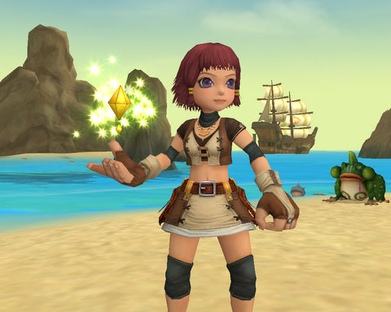
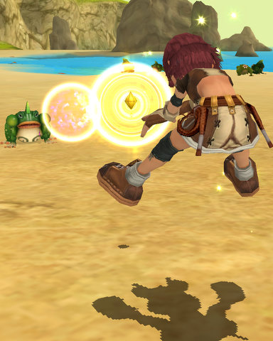
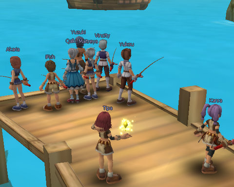
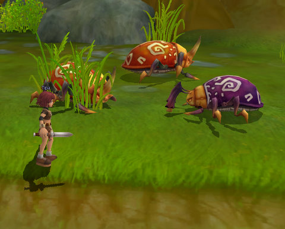
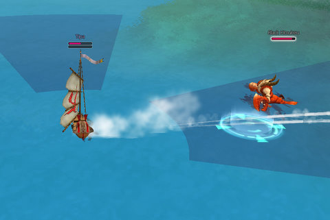
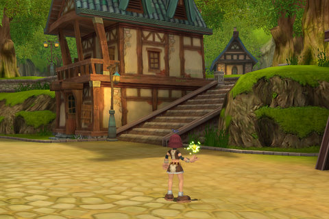

Back to: [West Karana](/posts/westkarana.md) > [2008](/posts/2008/westkarana.md) > [July](./westkarana.md)
# A first look at Florensia

*Posted by Tipa on 2008-07-25 08:15:56*

Adventure on land and sea? Lush, detailed world? Dual talent trees that let you mold your character however you like? How can it miss?

Florensia's kinship with Dream of Mirror Online couldn't be more unmistakable. That same sort of soft focus, cell-shaded look of the characters against backdrops so lush they seem to be almost painted. And these guys don't just sit around and swing at each other... they put their bodies into it, jumping and swinging and spiking stuff at the enemy. The birth of the aerobic adventurer.

You start off in the port town of Roxbury on Cardiff Island -- any relationship to actual cities is purely coincidental. This small fishing village is being assaulted from both land and sea by a variety of pests. On land, someone delved into a cave where no mortal was meant to tread, and a vile mist began corrupting the local wildlife. On the sea, the port is being harassed by gigantic lobster men who seem to be in league with some pirates.

The residents of Roxbury are going to need all your abilities on land AND on sea in order to survive. Also, you will need to fish.

Nothing says "hi, this game is from Japan" like hundreds of people all lined up against the water, fishing. And why not? Fish up some rare stuff and you can turn it in for upgrades.

The quests are thoroughly standard. Bring this thing to someone else. Go talk to that guy about something. Go kill ten of that and three of this and all the thoses you can find until you get ten wazzits from it.

The extensive tutorial leads you easily through battles on land, building and equipping a ship, and setting sail. It does fail a bit on how to actually kill stuff on the water; it took awhile before I figured out how to successfully join the fight against the Lobstermen from the Deep but yeah, I eventually got all Cloverfield on their butts.

I designed and built that ship, by the way. That ain't no tutorial ship.

There's only the one race -- humans -- and just four classes -- explorer, noble, mercenary and saint. Explorers are the rangers and hunters of Florensia. Nobles, those people in silks who never got their hands dirty with real work, are the nukers. The mercenaries are the basic tanks, and the saints are the healers. My character is a Saint. Isn't she JUST, though? Carrying a candle to show you how devout she is. A candle of FIERY DEATH she can HURL 50 FEET.

Those are just the templates. Similar to the late and lamented Mythos, you can build out your character anyway you like based on the talent trees. Each level, you buy a new skill. And each level, you get a point to put in a skill. The more points you allocate, the more powerful that skill becomes. All Saints get a basic heal, but that won't do anything unless you point points into it -- the more the better. But points in healing is points you can't spend on nukes and dots. And that's how that talent tree branches -- a healing saint, a nuking saint, or a DoT saint? It's up to you, and you can do a combination of, but you won't ever be good at all of them.

I haven't seen a respec NPC, but I can't see how there would not be one.

But is the game any good? I can't tell you that. I can tell you it isn't BAD. It does need some work -- for instance, the UI is not modifiable. These old eyes need text to be a little larger, and I'd like some of the other UI elements moved around. The movement keys are a little wacky; you can't turn in place, you can only turn while moving forward, which is weird. And you can't redefine them. The bouncy music plays continuously whether you are in battle or not, and it's always the same tune. So yeah, there's work to be done.

I feel it's impossible to actually judge how good an MMO is unless you play it for a month. Getting to land level 6 and sea level 2 hasn't taught me much about the higher level parts of the game. The animations are great, very over the top and entirely appropriate for the anime look. The talent trees are deep and it's easy to see how you can make a character that plays out just as you like it. You can just buy one skill and every level pump it higher and higher and become fantastic at that one thing, or spread out your abilities and be more a generalist. That's very nice. There's even (ahem) a menu that lets you select among the several languages Florensia supports (be sure to set this to English if you're an English speaker!)

If you can't stand cute anime characters, you're not going to like Florensia much. But if you liked Dream of Mirror Online but wanted something with a less Asian, more Western setting -- Florensia might be worth a look. And hey, it's free.

