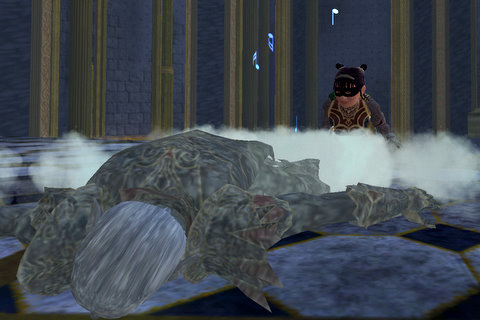

Back to: [West Karana](/posts/westkarana.md) > [2008](/posts/2008/westkarana.md) > [March](./westkarana.md)
# Bad Raid Videos FTL.

*Posted by Tipa on 2008-03-06 09:17:11*

That's Mayong dead there. He already had given me some new armor, but I wanted just a little more from him.

I wanted his teeth.

Nick yourself with one of his teeth, and you become a vampire yourself. That's kind of neat, isn't it?

Einhorn commented that there's a song about lining up to kill Mistmoore and then taking him down with a good kick to a sensitive area, but I couldn't find that song anywhere (too bad!). I did find a lot of Youtube videos showing people in EQ1 and EQ2 taking him down set to bad, loud music, though.

How did this become standard -- showing your poor taste in music instead of making your video more fun to watch? Why do people watch these videos? Because they want to see how awesome you are? No. Because they want to steal your strats. That's the only reason.

The very LEAST you can do is explain your pull strategy, how you deal with the script, things you might want to keep in mind... etc... because otherwise, nobody cares.

I watched this ten minute video of some guild doing all the Tier 2 Demiplane of Blood raids and the only way I knew what was going on was because I'd done most of them. Instead, bad music, boringly shot, and apparently their big secret strat is to corner a mob and then beat on him from behind.

Gee, you guys are pretty damn awesome. I wish my guild could be more like yours. And your poor taste in music just proves how out of touch I am, otherwise I'd be pumping my fist and screaming "DUDE! THAT FUGGIN RAWKS!" at the top of my lungs.

Actually, I *do* know where the whole "watch us be teh uber and also listen to loud music" can trace itself (again) back to Everquest 1, where some guild accidentally pulled every dragon in North Temple of Veeshan by aggroing Vulak, set to Metallica's "Enter, Sandman".

This video was hilarious :) Who knew it would inspire a hundred thousand bad imitations?

