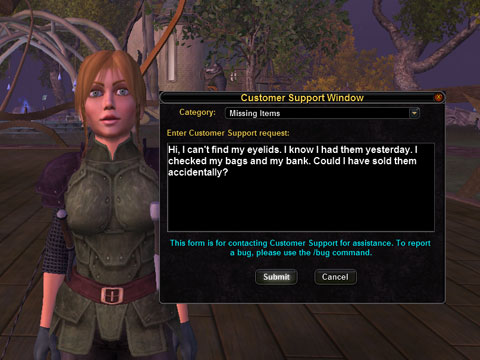

# VG: Can I have my eyelids back?

*Posted by Tipa on 2008-03-12 07:39:06*

I didn't have long to spend in Vanguard last night after my raids in EQ2; just enough time to patch and run around a bit. Veskal's Exchange, where I was parked, was transformed -- they have a griffin flightmaster there, and one of the new riftstones there, which promised me that should I gate back to Thrusk, that I could do those quests and easily return to Veskal without that long, long run back to Leth Nurae and through the Arcanium again.

The map is still a useless topographic map, but the points of interest are now far more intelligently laid out; Lakeview is on it, and it clearly pointed out all the nearby dungeons in my level range, which will make it FAR easier to find things to do.

In the fifteen minutes I played before, alas, having to sleep, there was just one thing that really stood out... mmm BULGED out at me.

So, SOE/Sigil... is there any possible way I could get my eyelids back? That lidless stare is creeping me out.

More on Vanguard this weekend, when I hope to find a group and explore a dungeon or two. 

Ya know, maybe more people would do them if they were called "FUNgeons". I think I'll petition that, too.

