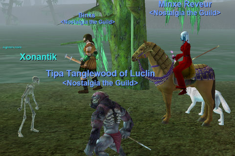

Back to: [West Karana](/posts/westkarana.md) > [2008](/posts/2008/westkarana.md) > [May](./westkarana.md)
# A Shrouded Experience

*Posted by Tipa on 2008-05-27 22:39:32*

Because people occasionally miss our Nostalgia nights, those who make all of them have outleveled those who do not. I, alas, not only not missed a night, but I sometimes do quests and group with guildies on other nights. The result: Some people were still at level 30 when I hit 40 and 41.

I wasn't sure how to get back in level range. Dying a million times to delevel isn't something I ever want to do. What I want to do is just turn off xp, or have it all go to AAs, but you can't do that at 41.

The solution turned out to be pretty obvious, once I thought about it. Use EQ's Spirit Shroud system to transform into a lower level character. I spent a long time looking over the suggestions, and decided upon the Kobold Cleric. It levels into a Kobold Rogue, a Minotaur Warrior and lastly, a Minotaur Berserker. I could definitely play a minotaur swinging a massive axe.

There was a group forming in the Moors, so I shrouded down to a 30 cleric, shoved all my monster points into direct damage and improved healing, and ported down. Stargrace on her necro was right there, and Woous who refuses to join the guild was with her. Malfi joined us as soon as he turned in some armor quests, and Binxs came along soon after. It was a kick-butt Nostalgia group, and the Moors is a hot zone, so we set down to killing.

I was getting xp messages. but my bar wasn't moving. "Groovy," I thought. "I must be too high a level, so I am getting no xp!". My shroud was xping slowly -- ending at 24% through the rogue shroud -- but it was all good until we finished and I removed the shroud. And dinged TWICE. Level 43 now, worse than ever. I am going to have to shroud continually until everyone catches up.

Sigh.

Well, at least they DO have the shroud. I can choose a level 35 shroud Friday, hopefully having the rogue by then. I can't wait until everyone is 51 so I don't have to worry about leveling. We'll be able to set hard limits and make them STICK.

Until then... don't be surprised if I look like a kobold in screenshots.

