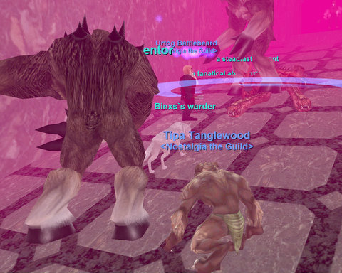

# Miragul, the busiest man in necromancy

*Posted by Tipa on 2008-05-31 07:37:02*

If YOU had to keep a bunch of different dungeons stocked with monstrosities, all day, every day, how would you find time to do anything else, like corrupting snow orcs, or plotting the destruction of the world or anything? The Everfrost LDoN instances? They are there to keep Miragul BUSY. He was working overtime last night as two groups of Nostalgians woke him up from his slumber to hand us some iced confectionery goodness.

I never know who is going to show up on our weekly excursions. That makes it really hard to try and keep everyone around the same level, determine where we can go and whatnot. Last night was okay; we ended up with two groups of four, but we weren't enough people to do hard LDoNs (though one group tried, and it was tough). We're also about to go past a druid or shaman's ability to solo-heal any sort of difficult content. Malfi did great for our group last night, but he was at his limits. Superior Heal will be a nice upgrade for him, but clerics have already gotten Complete Healing -- something that druids won't be able to compete with until the late 50s.

Anyway. I spent the night cursed into Kobold form, but it wasn't entirely a bad thing. I was a rogue again, which meant I could disarm traps, open locked boxes, and just generally be sneaky. DPS wasn't too bad; it wasn't great, but it was okay. Unlike the other group, we didn't attempt any hard LDoNs, and it was a fairly decent night. Some overpulls, but usually we were able to recover from them. A couple of deaths but no wipes.

While I like LDoNs, the points we earn from them are trivial -- I got 8 for each adventure last night -- and the stuff we would need are scattered all over six different camps, which must be raised individually. Until we hit the hard cap of level 51 and start working on AAs, we can't really start the extreme LDoN grinding we would need to actually get anything beneficial from the LDoNs -- and at 50, we'll be starting on the Dragons of Norrath missions anyway. The LDoNs have pretty much served their purpose for reasons of Nostalgia, anyway.

With 51 so close, we're going to be focusing on hot zones to hit the cap. Next week was going to be Lower Guk, but after thinking about it, we're going to be headed to Dulak Harbor, a hot zone for 40s, and see if we can just get into some pirate-killing action and work out a few quests while we're there.

