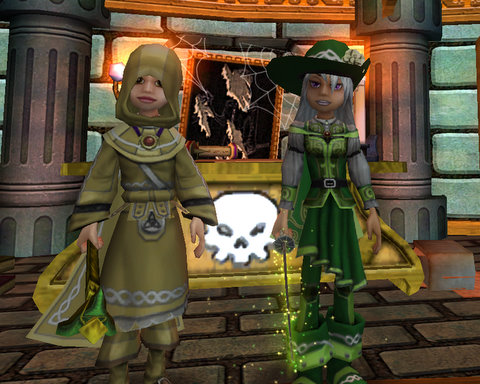

# Wizard Friends and LittleBigPlanet Mazes

*Posted by Tipa on 2008-11-10 09:36:17*

I was going to title this, "Friends don't let friends play Wizard 101" because it's so addictive, but I couldn't. I really, really enjoyed playing my current crush with friends this weekend.

I have this dream... that someday, I will fight through the Master's Tower in Ravenwood and at the end of the battles, when I meet the final boss, Pumpkin Head, he will look at me in his terror, and just before I play that final card that will call down a centaur from the heavenly plains upon which he runs to split the villain's vegetable head with a fierce arrow, he will say... Pumpkin Head will say...

"Damn. How many times are you going to KILL me?"

"Just until you cough up that Clockwork Spider."

"Well... if I knew it meant so much to you... here, and good riddance!"

Yeah, then I wake up and run the instance again and no spider. I have a dozen little imp pets from it now. I've seen low level people running around with the spider so I know people do get it. I don't NEED the pet, but once I heard that this was the uber-rare prize of the Halloween festivities, I wanted it.

Sigh. I even made an alt to help run the instances faster -- that's her in the picture. She's a Balance/Death mage, which is a pretty awesome combo, actually. Not a huge DPS machine, but better than Life. I have her there to shut down the enemies with Weakness, boost my elemental shields so they can't hurt me much, and to help with the killing. Plus, I figured, twice the chance that a character of mine gets the spider!

No luck so far.

I was SO THRILLED, though, when [Stargrace](http://mmoquests.com/2008/11/08/wandering-through-wizard101/) and [Cownose](http://cownosethe50poundcat.blogspot.com/) made characters and dropped by. I was two boxing at the time; running through the Plague Oni instance with my friend Keelan AND leveling my alt via the low level quests (while the Master's Tower is great for loot, the experience for an entire run of Rank 4-5 monsters is less than 100 xp, so can't be used for leveling). 

Wasn't too long before I suggested a perfect group opportunity for us all -- the Master's Tower!

Oh well :)

These last weeks before all the new expansions and games seem to be giving people an excuse to try out newer, indie games. And though I didn't see him online, [Hudson](http://hudshideout.com/blog/?p=1029) was also running around, crisping ghosts and skeletons.

Wizard 101 is taking over the blogosphere by Storm, Fire, and Ice... :)

---

I spent several hours working on Yet Another LittleBigPlanet level. One thing that is clear in all the best LBP levels is that they are GAMES. Befallen is a level I do want to finish, but the slow, steady, spooky pace that seems best for Befallen is opposite of the frenetic action and over-the-top puzzles of the typical LBP level.

Yesterday I started work on a level I'll likely call The Ironworks, which is a sky-scraper sized open framework of girders which give lots of spaces for puzzles and being shot at high speed through all manner of things. As well as being a maze.

For all its size, I'd like to keep the player generally moving fast enough so that you could clear the thing in five to ten minutes. Medium danger. High speed. Some tricky puzzles.

It took a really long time to build the building, so much so that I only had time for one puzzle -- using the rocket sled I built in Tanglewood Labs. Here's the video of that first puzzle. (The sound for some reason doesn't seem to have been captured).

