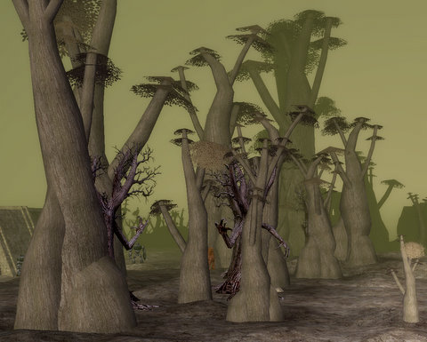
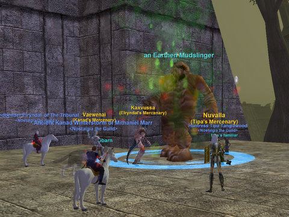

Back to: [West Karana](/posts/westkarana.md) > [2008](/posts/2008/westkarana.md) > [November](./westkarana.md)
# EQ: Vegarlson, the Earthen Badlands (the Plane of Earth)

*Posted by Tipa on 2008-11-23 00:05:03*

Of the four elemental planes, the plane of earth is the most unusual and certainly the scariest. Strange, silent, deadly creatures lurk everywhere; some burrow underground, and pop up to attack you as you pass. The Rathe Council has abandoned the plane to meet and discuss things in their own sub-plane, leaving their larger plane alone to grow strange.

All good news for us, though. The Plane of Earth was a reward, back in the old days. A gift to the serious raiding guilds. If you attended all the raids, a hundred times, in the right order, and the markings on your arm all glowed the same hue, and you had no lost memories, and your guild's scouts had seen Rallos Zek the Warlord pop before any other guild, and your pullers had managed to get the two trigger mobs claimed and mezzed while the guild gathered, and after that, managed to do a raid that was not only timed but required almost inhuman teamwork and rarely-used abilities and outright sneakiness, well, then the planes of Earth, Air and Water would open for you, and the best experience in the game would be yours.

Getting to the Plane of Earth meant you were the best. Back then, you couldn't sneak someone in. Being able to zone in meant you had done every single one of the raids that led to it.

Naturally, non-raiders were angry that the very best parts of the expansion were closed to them, and even raiding guilds resented having to redo easy raids for new recruits. SOE made up the 5/6 rule, which let one unflagged person into a zone for every five flagged people. Now anyone can zone in, and it isn't quite so special.

It's just as creepy, though.

Tarfu was having severe computer problems, so Elryndal, Kanad and I set out on our own, with our bots. I re-bought my bot to get a level 64 version, but I'm not sure I needed to. The one time I died, though, she put Virtue on me instead of the lesser Blessing of Aegolism she normally casts. I guess she felt guilty.

Named mobs pop from traps, so part of the pulling strategy is to find the traps and bring the mobs that pop back to the group. You're never quite sure when you're going to be suddenly joined by a new friend or two, but if you don't try and trigger them when you can -- no nameds.

There was one named in particular I was eager to meet -- the Prismatic Baslisk. This croc CAN drop the ranger pet weapon -- it summons a wolf when it procs that fights for a few seconds before it disappears; the more modern version of the Scimitar of the Mistwalker, that Lady Vox once dropped -- and which was nerfed several times before finally being removed. The mostly-nerfed version is still available in the casino, but it has become useless. The weapon that drops in PoE from the Basilisk, though, is special.

We did spawn the basilisk, but it dropped its common dropped, the caster mask. It rotted. Nobody even bothered looting it to clear the mob.

Same with the other named we spawned, The Living Earth. Its corpse just laid there until it rotted in half an hour.

The experience was decent. Both Kanad and I reached level 65. Elryndal made 7 AA. I really missed being there ca. 2003, back when being there was something very special.

We made a new friend in Stompn, who joined the guild with his 75 warrior but intends to join Nostalgia with an entirely new character. The mercenaries make that possible, leveling a character from scratch, and we're looking forward to having him in the group.

We have not gotten many of the level 61-65 spells and abilities, but since we're heading for 70, those don't matter so much -- most will get upgrades. Unfortunately, we'll have to struggle with the bizarre Omens of War spell rune system to get our 66-70 abilities. The 70 spells will be impossible to get. The Glowing Muramite Runes drop only from raid mobs in the Omens of War. Level 69 Greater Muramite Runes drop from lesser nameds, and are not uncommon in Riftseeker's Sanctum. The level 66-68 runes drop from nameds in the lower level zones.

We won't be grouping enough in OoW to get a significant number of spells in this range. This hurts melee far more than priests or casters, as the most powerful melee attacks come only from the level 69 and 70 runes.

The Serpent's Spine expansion raised the level cap to 75 and also introduced a tiered system of spells, similar to EverQuest II -- one of the few things EverQuest took back from its sequel. You can buy Mark I version of all spells and abilities. Mark II are found in appropriately leveled groups, and Mark III come from raid mobs.

There was some talk about heading to TSS and the level 65 hot zone, Sunderrock Springs, but we decided instead to visit Doomfire, the Burning Lands AKA the Plane of Fire when we meet again, the week after Thanksgiving.

The last time we went, we had to kite. Now, we'll have Tarfu to tank and mercenaries to help heal, tank and dps, so we'll be headed in deep, where the experience is absolutely amazing. The spot I'm thinking of even has some lesser nameds, meant for a single group. If we can defeat the 2K-hitting Prismatic Basilisk in PoE, these should be no trouble. Assuming we don't lose anyone on the way through PoF. It can be a very, very deadly zone. Not Plane of Air deadly, but just less than that.

I finally fixed my signature program which had been broken since SOE changed the EQPlayers character page a couple of months back. So, there it is.

