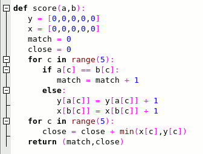

Back to: [West Karana](/posts/westkarana.md) > [2008](/posts/2008/westkarana.md) > [October](./westkarana.md)
# How to tell if you're a coder, part 1.

*Posted by Tipa on 2008-10-07 08:01:24*

Step 1: Start browsing the games Xfire claims are installed on your system and come across a children's version of that old game, Mastermind:

Step 2: Spend 15 minutes writing a program in Python to solve it for you.

Step 3: Suddenly realize you missed the point of the puzzle in the first place :P

We had to do a version of this game as a programming assignment in Pascal back in college. It took a lot longer than 15 minutes back then. Python > Pascal. That's all.

## Comments!

---

**Sean** writes: I have no idea how that puzzle is supposed to work, but by looking at the code I think I can make a guess.
Be easy on me, I don't know Python ;)

Array for x and y have 5 places, they are one dimensional.
match and close are place holders.
Okay then a for each loop. Iterate through the range of 5... 5 times? I'm not to sure on this one. It looks like a for each loop, but also like a regular for loop.

Okay so I'm going to go with it being a for loop that goes through c five times. Since a b and c are not defined in the screenshot, I'm guessing that these are user inputs that arn't in the picture. So if a and b are the same at the c position in the array then add one to match! Else add one to x and y. 
Then go through c again 5 times...(this format is so strange to me, it probably makes a lot of sense to you).
Close = close plus the smallest value in the array of x,y?

Well even though I don't know exactly how those for loops work (please explain though :) ) oops double parenthesis... 
where was I oh right, the return statement clearly shows that it's giving you the position of the object you need in the puzzle game (which I think you dress a teddy bear).

It's late...

---

**Tipa** writes: The part of the program you don't see generates all possible solutions then eliminates from that solution space all solutions that are inconsistent with the results of each move from the game.

Mastermind, of which this is a variation, is a guessing game. One player sets from three to five colored pegs into a pegboard, hidden from the other player, and the other player has to make guesses as to the solution on their peg board. After each move, the first player tells the other player how many pegs are the correct color in the correct position -- matches -- and how many are the correct color in the wrong position -- close.

The function above takes a possible solution, an array in 'a', and a previous guess, an array in 'b', and scores them, returning a tuple (basically an array with fixed elements that can be used as a scalar constant) that is compared to the results from the game.

"range" is a generator function. Each time it is called, it returns the next number in a sequence. In Python, we could write range as:

def range(n):
   i = 0
   while i < n:
      yield i
      i = i + 1

"range" is actually more complicated than that. I just use it here to make the loop go five times.

I go through looking for exact matches. If I find one, I increment the number of matches (yay!). Otherwise, I increment the number of times we have seen the match from color and match to color in their respective arrays.

Lastly, I go through these arrays once more. If a color was seen twice in the potential solution and once in a guess, that would be one that was close but not in the exact position. In fact it turns out that the sum of the mins of these two arrays is the number of close calls. If I'd wanted to be an uber Python programmer, I could have written that entire loop as:

close = sum([min(x[c],y[c]) for c in range(5)])

The "[f(x) for x in set]" is a quick way of making an array from a function applied to a set, in this case, the set of [0,1,2,3,4].

Python is a quick and powerful language. I use it to develop algorithms and stuff before I translate it to Java or something.

