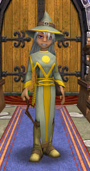

# Wizard 101 goes live

*Posted by Tipa on 2008-09-02 07:25:47*

Wizard 101 goes live!

> KingsIsle Entertainment is very happy to announce the launch of our first title, Wizard101.

To celebrate, we are offering a 1-year subscription for only $60! That’s a 50% savings off the monthly subscription rate! This offer will only be available until Monday, Sept. 8th. Subscribing will also give you access to text chat, posting on the forums, getting more powerful equipment/clothing/pets, and teleporting anywhere to friends and family.

Subscriptions will be $9.95/month, $49.95/6 months, or $79.95/ year.

The instant teleport to anyone on your friends list, by the way, is one of the most important features of Wizard 101. You won't be able to get very far in many of the harder instances alone. Being able to summon friends is the only way through these places.

Assuming no "miracle patch", players can expect a fairly easy and fun game through the first world, Wizard City, ramping up to pretty much group-only fighting in the last world currently released, Moo Shu.

Although not mentioned in the brief announcement, it is said (WHERE do people find out these things?) you cannot finish the first world, Wizard City, without subscribing. I did log on and play this morning with my new Life (no longer Myth) wizard and no questions about billing were asked, so it still definitely remains free to try.

**[OH HERE'S SOME MORE INFO](https://www.wizard101.com/site/posts/list/1761.ftl):**

> Hey folks, I wanted to drop a quick note about the pricing model before the game goes live. We’re going to be using a “hybrid model” for Wizard101, which means that the game will be available with limited content for Free (roughly half of Wizard City, and the PvP system which will be coming online shortly after launch.) Players can purchase unlimited access to all of Wizard101’s content in a couple of ways:

- Monthly Subscription. You can buy a recurring subscription for $9.95 per month that gives you full access to the game content, chat systems and other great benefits.
- Pre-paid subscription. You can buy a recurring subscription for 6 months or 12 months at a discounted price.

In addition, we are looking to bring other pricing options online shortly after launch:

- Time for Crowns. In addition, we’re going to allow you to buy pre-paid months using crowns. Initially crowns will be available online, and eventually (through some really cool programs that we haven’t talked about yet) we’ll provide other ways for players to get crowns, as well.
- Other pricing options that will be announced at a later date

We have a lot of exciting stuff coming down the pipe, but the first step is to get the game launched successfully … so to make that happen, we’re going to start with the traditional online game model of subscriptions and a cash shop. Stay tuned as we bring you more options post launch and, as always, enjoy the game! 

