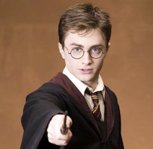

# What would a Turbine Harry Potter MMO look like?

*Posted by Tipa on 2008-09-07 13:07:32*

 Openedge left a comment to one of my Wizard 101 posts that implied Turbine might be working on a Harry Potter MMO. This isn't the first time they have turned a popular property into an MMO; they did it a couple of years ago with Dungeons and Dragons, and last year with Lord of the Rings Online.

So given how they handled those two properties, what could we guess about a Harry Potter MMO?

They've shown with LotRO that nothing the players do can influence in the slightest way, the main story. The players cannot even play a part in the major elements of the story.

Since Slytherin and Gryffindor are the houses most involved with the story, players will belong to the other two houses, Ravenclaw and Hufflepuff. Well, some characters came from Ravenclaw, so just Hufflepuff.

Hufflepuff, in the MMO, would be the house that provides servants and workers to the other house. Quidditch game coming up? The Hufflepuff wizardlings -- the players -- will be tasked with clearing the pitch of bears (it's always going to be bears) and boars which have somehow crept in over the night, harvesting straw for racing blooms, and killing hundreds of insects looking for the perfect replacement wings for a worn out snitch.

The Hufflepuff players would also craft the pranks that the Weasely Twins come out with. And most importantly, they will fight Voldemort's henchmen, the Death Eaters. The main boss mobs will all be Death Eaters that don't appear in the books.

Every so often, you will hear news about Harry Potter's adventures. It will be as if you were right there, in Hogwart's, hearing about all the amazing things that happened, from someone (not you) who was there at the time.

Yeah, I wasn't a big fan of how Turbine set LotRO in the midst of the War of the Ring but didn't let players take part in it. They should have set it in a different time period. It's all cyclical, anyway -- first Morgoth, then Sauron. Couldn't there have been a different evil in between those two that the players could band together to defeat, lest the whole of Middle Earth fall into darkness? Maybe really early, when Men first appeared?

SOE actually has managed to figure out a way around this. In DC Universe Online, the main heroes like Superman and such work with you as a team. You and Supes work together, but often he is called away for another emergency and it's left up to you.

In the Harry Potter MMO, it could be set in the time when Harry Potter is an Auron and is guiding the players toward rooting out nests of Death Eaters and other evils which continually threaten the peace and stability of both the magical and Muggle worlds. Or even be set in other countries' wizard schools, where they could have adventures totally separate, and perhaps grander than, the ones in Potter's Britain.

Still, it's hard to imagine Turbine coming up with a Harry Potter MMO that is anything more than a media tie-in game, like the ones written as part of the marketing push for every kid movie. Shrek Cart Racing. Etc.

