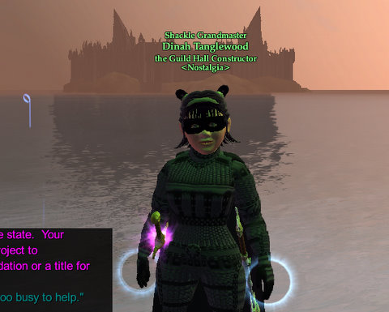

# EQ2: That's MS. Guild Hall Constructor to YOU.

*Posted by Tipa on 2008-09-23 12:00:35*

Thought I'd never finish the thirty gathering missions necessary to get the "Guild Hall Constructor" title. I'd get bored, or find something else to do, or... pretty much anything else. But I did want to get the title before the event ends. After all, what better way to tell the world you're an obsessive-compulsive whose probably going to try and sell you something?

It would have been harder without Stargrace's sage advice. She would grab a mission and head to Sunken City. Few people went there. If she couldn't finish the mission there, the Graveyard was a short hop away, and it would have the stuff.

I made sure and harvested all the creature and shrub nodes, because neither one was needed for the tier 1 harvesting quests, and it would be best if they were harvested so they might respawn as something useful. On the way back, I'd see which harvest was most plentiful, and make that my next assignment.

Worked pretty well. It was awfully dull, though.

GU 49 looks a lot more exciting -- there, you'll kill and craft to help drive back the invaders. ANYTHING but that tedious harvesting!

Anyone want some waxed leather armor? A lot of it? Just let me know.

