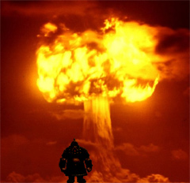

Back to: [West Karana](/posts/westkarana.md) > [2008](/posts/2008/westkarana.md) > [September](./westkarana.md)
# Straight Talk Warhammer: The Dwarf Engineer

*Posted by Tipa on 2008-09-24 07:55:04*

Ever since Blizzard created the MMORPG genre with World of Warcraft, generations of people wondered if the genre they invented would end with that game -- it was just so good, such a shining gem of perfection, that to add or subtract any one thing to that game would just mar its sublime beauty. 

And then Mythic dreamed of a new game, one as polished as WoW, but with things WoW had never imagined, like two sides forever at war -- at WAR! -- and battlegrounds where the two mortal enemies could meet in order to take on well-defined challenges for points. The name of this paragon of innovation?

None other than Warhammer Online: Age of Reckoning. That's WO:AoR, which is kind of like how a ghost would say "war". And there's no WAR class better at turning people to ghosts than WAR's own little mad bomber, the Dwarf Engineer.

  
*Simulated Warhammer screenshot.*

A dwarf engineer walks casually out of a post office, schoolhouse, shopping center, whatever. He scratches a match to fiery life on the back of his knuckle, lights a cigar, and -- BOOM! -- terrified screams are brought to a sudden end as the entire building goes up in flames. He takes a deep drag from the cigar, smiles, and walks slowly away.

Because Engineers don't kill people one at a time. An Engineer isn't happy unless he is killing people by the dozens. An Engineer isn't happy unless he's destroyed the peace and happiness of an entire nation.

Try and turn away all dwarfs at the border, and they protest and call it 'profiling' and tie up the international courts for MONTHS. The is why you must fight dwarfs THERE so you don't have to fight them HERE. Take the fight to them. That's the only way to kill an Engineer. Hit them where they live, hit them fast, and hit them hard.

And you don't even want to KNOW what an Engineer can do with an eight ounce bottle of Listerene. Three ounce bottles of Listerene are okay, though. They can't do anything with those.

Dwarfs are really pretty skinny -- not many people know that they are wiry little guys and gals. Why do they look so round?

Reloads. A Dwarf Engineer was once apprehended by the virtuous agents of Chaos and found to be carrying three shot guns (one with a sawed-off barrel), ten grenades, enough plastic explosive to level a city, three bandoliers with two hundred shells each, a dozen detonators, two rolls of duct tape and a hundred meter spool of copper wire.

They would have had more, but they'd just been running down to the corner store for matches.

---

*Holy smokes! We've come to the end of another edition of Straight Talk Warhammer! Come back tomorrow, same time, same place, when we discuss the Dwarf Engineer's less psychotic cousin, the Rune Priest. Remember, if it's Warhammer, and it's Online, there's only one place to get the Straight Talk about it.
*
## Comments!
---
**Openedge1** writes: Hello\r\nMy name is commenter, and felt this post needed a comment. (*Hey Commenter*)\r\nI have been without comments for 0.2 seconds today.\r\n\r\nNothing else to share.\r\n\r\nHow is your day?
---
**Tipa** writes: Thank God for you :)\r\n\r\nI guess peeps don't like Engineer ><. They REALLY won't like what I do with Rune Priests tomorrow!\r\n\r\nInteresting thing about doing these, though, is that I never really paid any attention to what classes were in Warhammer. Well, aside from the White Lion, which I thought was kind of perverse, but aside from that, I didn't know what they were. So there's that.
---
**Sean** writes: Well, I've played the engineer to level 12 and I'm extremely unimpressed with the class. The turrets die quickly if being attacked, and are affected by all sorts of stupid ailments when being attacked. (Like bleeding... and disease dots... THEY'RE WOOD AND METAL THEY DONT BLEED!!!!!!!)\r\n\r\nAlso their single target dps is amazingly bad. Epic bad. I couldn't kill anything by myself unless I got the jump on them, they didn't run away, not a healer, not a tank, and not at full health. Yeah, it's that bad. \r\n\r\nBut hey, my grenades do AOE damage and kind of bug healers because they have to cast ONE regen HoT and it negates all my damage from dots. Wooo engineer!\r\n\r\nAlso, our turrets SUCK! They do less dps  than a druid pre 2.0 WoW. They have a hard time killing level 2 critters, let alone being useful.\r\n\r\nI REALLY wanted to enjoy this class, but so far it's been a burden to play.
---
**Sean** writes: BTW, lol @ the nuclear explosion from the engineer. I wish it were remotely true.
---
**Openedge1** writes: <i>I REALLY wanted to enjoy this class, but so far it’s been a burden to play.</i>\r\n\r\nThis could explain the very quiet nature of this post today. I was almost of the belief that things would turn bleak after this. No comments? What happened?\r\nSome of the normal WAR commenters have not even shown up.\r\nIn so many words, maybe most of them felt the Engineer needed a ribbing and have nothing to say otherwise.\r\n\r\nAll I could picture from your descriptions was a new EA title...Mercenaries 33: WAR!
---
**Tipa** writes: I dunno. The EA Mythic page on them (which is about all I know about any WAR class) says they are short-medium range firepower, and helpfully suggests they have no defense against long range dps classes, and are meant to stand just outside of a battle lobbing in grenades and using shotguns to keep people away. Doesn't seem like a flashy class, but people are talking about them so I imagine(d) a lot of people like them.\r\n\r\nPeople still don't know what some EQ2 classes are four years on, especially the evil ones -- I've met no end of people who don't know the difference between defilers, inquisitors, and necromancers, or even apparently know they exist. Witness the groups asking specifically for templars, as if that was the only cleric.\r\n\r\nAnd don't get me started on Vanguard classes.\r\n\r\nIt's going to take longer than a month to get everyone used to the role their class plays in a battle. When they were cutting classes in beta, Engineer survived the cut, so the devs must have felt it had some value. Though with the huge prevalence of fairly straightforward and universal classes like Bright Wizard and Warrior Priest, sounds to me like people are unwilling to stray too far from their comfort zone.\r\n\r\nEngineers have three tracks. I bet someone who focuses on, say, shotgun -- an attack with the advantages of being a caster (your target can jump all it wants) and melee (right in the action), will eventually be doing rogue-like damage.
---
**Sean** writes: The three <strike>talent trees</strike> "career masteries" you can go into are as follows.\r\n\r\n1. Path of the Rifleman - Sniper shot, focus on doing dps from behind the lines.\r\n2. Path of the Grenadier - Focuses on being an aoe damage, mid range behind-the-tanks-infront-of-healers-and-legolas-archers grenade lobbing crazy mofo.\r\n3. Path of the Tinkerer - Makes your turrets and land mines better. I think I'll give the class another go tonight. Maybe it will be different in the 20's
---
**redheadedtim** writes: Why do they look so round? Reloads. Classic. I also give a hearty har har to "which is kind of like how a ghost says war." Thanks again for this insightful view into a game I will likely never buy. Judging by your screenshots, the graphics are suprisngly outdated. Ugh. I'm looking forward to the Zune Priest review. I had heard that I need to get Zune tatoos in at least 3 places on my body. Now that's what I call High End System Requirements!
---
**Tipa** writes: Well, they can be High End if that's where you put them. If you put them on the Low End, though, please -- I don't need to see them.\r\n\r\nZune priest, huh? That's good :)
---
**Sean** writes: I'm going to send you an ACTUAL screen shot tonight. Can you send me an e-mail?
---
**almagill** writes: Dorf ingineers rock!\r\n\r\nOK, they're pretty hopeless solo as you really need somebody slapping on the bandaids and you can serious PO an entire battlefield by switching your turret into aggressive mode and giggling like a five year old on a sugar high as every greenskin in spitting distance gets hit with the Peashooter of Doom.\r\n\r\nCan't understand why the rest of my team just stand back and let me get ripped apart though. I mean, I was helping... (and I got first strike on *everything* so, well, really good looting and scavenger options, heh)\r\n\r\nBut y'know, all that doesn't matter as dorfs get PUBS and PUBS got ALE!!
---
**mmorpg vet** writes: "Ever since Blizzard created the MMORPG genre with World of Warcraft..."\r\n\r\nread the rest of the article and still couldn't tell if you were being serious...
---
**Tipa** writes: The Bomberman screenshot wasn't enough? :P\r\n\r\nNo, I'm not being serious :)
