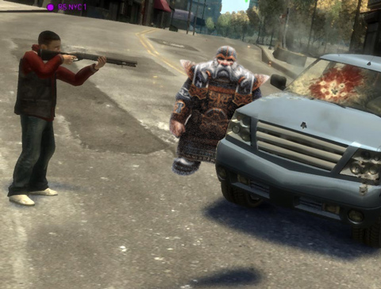

# Straight Talk Warhammer: The Runepriest

*Posted by Tipa on 2008-09-25 08:00:33*

You love you some Warhammer Online: Age of Reckoning, but the game isn't addicting enough. There should be some way of making your time away from the game an interminable hell. If only... if only there was a career that could give you such a high that when you came down, all you could think about would be your next fix -- and the next after that.

Meet the best friend you will ever have in the game, the one whose number is #1 speed dial on your cell phone, the one who always has what you need -- the Runepriest.

  
*Simulated Warhammer screenshot.*

There's nothing subtle about the Runepriest. You'll see him in the dark shadows of every battlefield, surrounded by his Witch Elf honeys, dispensing the runes. You know you want that health rune, dontcha? Yeah you do. You feel uber with that health rune. And that strength rune, man, that fuggin' turns you into a Public Quest pretty much. Dude just got in some Runes from the Empire, them are Elf runes, and they'll totally mess you up.

But watch out for those protection runes. Yeah, they totally give you a high so high you can see the next chapter without even looking up. But you have to keep paying the Runepriest, or he'll take your protection away, and then you better be watching out for your wheels and your women, 'cuz without the Runepriest protection, they is up for grabs.

What? You want to be a Runepriest? Well, let me cut you in on a little secret: It's all about the connections. Because the other Runepriests don't want your dwarf wannabe ass taking a slice of the rune pie. And no way you can make it out there alone. What you have to do is make some friends with the local law. You can give them some gold, and they'll stay bought until it's gone, but lay some runes on them and you have friends you can count on.

And then you can be all like, yeah, I have some protection runes, local stuff, good stuff, but I just made some really wild stuff, real rare, and to be honest, I don't think you can handle it. And they're all, yeah, I can handle it. I can take whatever you got. And you say, this is gonna cost you, I can't be making these things every day, you can't even afford it. Lemme just bag you up a dime bag of the regular runes. And they're like, dude, I ranked #1 on five PQs last night, show me what you got. And you're like well, okay, if you think you can handle them, but I better not see your saggy human ass banging on my door in the middle of the night unless you got some shinies in your backpack to pay. Cuz I got plenty of strung out junkies like your own self being my doormat ALREADY.

And they're all, hey, dude, I'm not like that. Here's the swag, now gimme the bag.

Yeah. We're talking repeat business. We're talking logging in, and seeing guild chat light up with people wanting your runes.

Damn, it feels good to be a Runepriest.

---

*Strung out and hung over waiting for the next edition of Straight Talk Warhammer? Don't be! Read about the secret details of every Warhammer career every weekday. This is the only place you can get the straight dope that Mythic won't tell you. The only place that dares tell the truth about Warhammer: Age of Reckoning.
*
