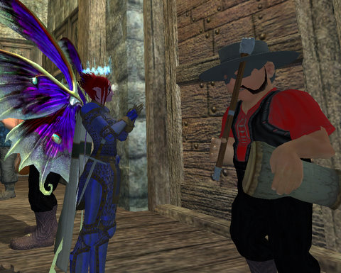
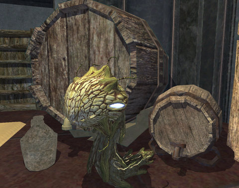

# EQ2: Brewday, or: How did I end up HERE?

*Posted by Tipa on 2009-03-14 07:40:04*

...

No, please, just give me a second ... I remember it, at least I think I do ... Dammit, someone turn out the lights. Oh, that's the sun? Then could someone PLEASE TURN OFF THE SUN?

Gah. My head ... Oh, you want to know what I did on Brewday?

Damned if I know. The last thing I remember was getting together with the drummer from the band after a few of their songs and ...

Would you STOP MOVING SO FAST? I have enough trouble focusing ... well, just sit still or something.

Anyway, so I wake up back in the Guild Hall with a few kegs, a mostly-empty stone stein, a cabbage with eyes and an evil grin that calls me "Mommy", and a tattoo on my rear that says "Brell Was Here". I wouldn't even have noticed if it didn't hurt so damn much.

Anyway. I'm just gonna go back to bed for a week and then see a sage about getting that damn tattoo removed.

And if the sage so much as snickers, he's dead. DEAD.

