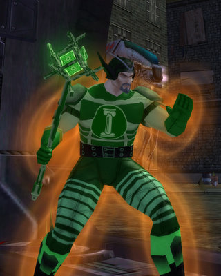

# The League of Cruelty presents: Mad Money and leveling pacts

*Posted by Tipa on 2009-03-15 10:39:17*

Name: Mad Money

Power: Mad Money uses his infamy and notoriety to manipulate the financial markets of the Rogue Isles. Once a lowly hedge fund manager, the Complicit Netherworld Broadcasting Corporation recruited him and now use his powers for their own nefarious ends.

Weaknesses: He wilts in the face of laughter.

Supergroup affiliation: Minion and sometimes spokesman for the Complicit Netherworld Broadcasting Corporation.

---

Kasul and I finished up our missions in Mercy Island last night and headed in to Port Oakes. Port Oakes is where the game world expands -- you get the newspaper missions, the mayhem missions, teams are easily available at a wide range of levels. Leveling to eight wasn't too hard. I'd had a date with Thomas, the Friendly Necromancer to do the second half of the assault on Malistaire's Lair in Wizard 101, so i ducked out for a few minutes to save Dragonspyre, again, from the reawakened Dragon Titan. Kasul had to work today, so he decided to head to bed.

Heck, I wasn't sleepy :) After Malistaire refused, again, to give me his robe, I returned to CoV and joined a team and leveled us both, via the leveling pact, to level 10. This morning, I joined another team and reached 12... that will be enough. Well within sight of level 14 and our travel powers. I urged Kasul to go for flight because flying is so cool, but I ALWAYS choose flight, so I'm going with teleportation instead. Turns out that I got a temporary flight power by finishing a mayhem mission, so -- I can fly, AND soon be able to teleport!

