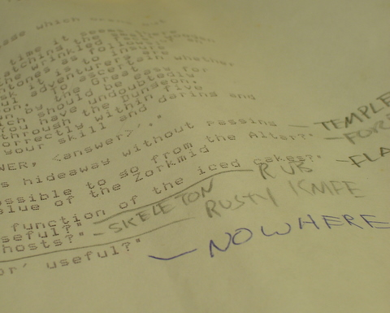
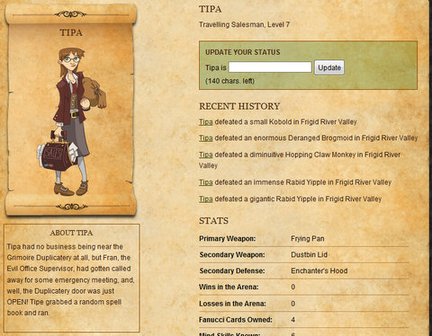
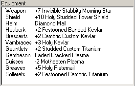

# Achiever games: Legends of Zork and Progress Quest

*Posted by Tipa on 2009-04-17 07:33:50*

On February 17th, 1980, around 10PM, I was so frustrated with some puzzles in Dungeon (which would later become Infocom's flagship game, Zork), that I found out where on the University of New Hampshire's engineering school's VAX-11/780 the game was installed, and printed out all the text in the game, hoping that would give me some CLUE to the devilish puzzles. I still have that printout, covered with my scrawled notations and maps. Why I've kept that printout over twenty-nine years -- longer than many of my friends have been alive -- I don't really know, but there it is. I look at those words and remember nights spent in the lab learning about programming sound, graphics, user interfaces and compilers, but late at night after all the homework was done, trying to solve yet another puzzle in Dungeon.

So Activision/Jolt's "Legends of Zork" browser game stands in the shadow of a mountain of history with me. 

Zork comes from an earlier time. The popular computers of the day -- the Apple II, the Radio Shack TRS-80 and the Commodore PET -- barely had graphics at all, and there was no way a poorly drawn picture could come close to the richness (or humor) of a well-written paragraph. Zork's wit and fiendish difficulty were legendary.

None of that is present in [Legends of Zork](http://legendsofzork.com). In LoZ, you make a character and then send it out for twenty or so adventures (you are limited in how many adventures you can have per day). You get a short report detailing the monsters your character faced and what they looted after each battle, and that's pretty much it. It wouldn't even be all that much trouble to write a script that would run the game automatically so you would only need to check in every few days to see how your character was getting on.

Legends of Zork is just the latest example of what I call an "Achiever" game. The famous [Bartle Test](http://en.wikipedia.org/wiki/Bartle_Test) identifies four broad categories of gamers -- Explorers, Socializers, Achievers and Killers. Achievers care most about having the best score -- the best dps, the best gear, the most achievements (natch), the most pets, whatever. They're the type who put on their flashiest gear and go AFK in public places. 

Like that +10 Holy Studded Tower Shield? Yeah, I got that off a Battle-Leucrotta. FOUR of them. AT ONCE. Killed them all by myself. I already had a better shield, you know, a +50 Glowing Reflective Buckler of Boo-Yah, yeah, I got that. Someday you maybe can ... lol nah, not you. Noob. Check out my +13 Heavy Stabbity Spontoon!

[ProgressQuest](http://progressquest.com), the most popular RPG on the most popular Linux distribution, Ubuntu (really!), was a game made for Achievers and the spiritual ancestor of Legends of Zork. All you need to do is install it and set it running. Your character will go out, have adventures, level, loot, return to the market to sell and buy upgrades, complete quests -- all without you having to do a thing. But the bragging rights? All yours. 

Though it satirizes and distills Achiever-based gameplay, PQ, in its simplicity, points out how powerful the draw of getting new stuff is in modern gameplay. The [most popular MMO in the world](http://worldofwarcraft.com) is based almost entirely on Achiever gameplay (and they have recently added an entirely new chunk of game devoted toward earning even more achievements, just for bragging rights).

Given the huge popularity of Achiever games these days, it's no shock that when Zork came back, it did so as an Achiever game instead of its original incarnation as an Explorer game.

Where are the Explorer MMOs these days? Vanguard struggles along, but since they don't even offer a real map in the game, the possibility of stumbling upon something entirely new is always present. EVE Online supports exploration, but EVE is set in space, there's really not much to see aside from another planet, another enemy base, another asteroid belt. Most every other game is presented fully mapped and explored before the first real player ever sets foot in it.

We're in an Achiever world, and we just better get used to games becoming ever easier while the rewards become more and more grandiose. 

This is funny. I played my twenty daily adventures in Legends of Zork today and I can't remember even one of them! I made over 4K Zorkmids, though.

