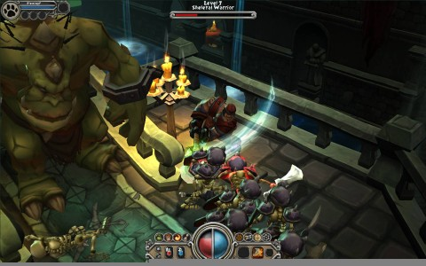
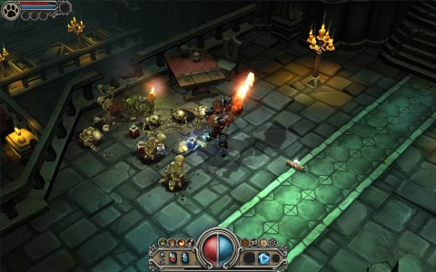

# Torchlight: The second coming of Mythos?

*Posted by Tipa on 2009-04-23 19:38:04*

The founders and developers at Flagship Studios-Seattle, makers of the doomed but wonderful Mythos MMO, formed Runic Studios from the phoenix ashes of Flagship and have come back to life with the Mythos dream clenched in their fiery beak.

Um. Too flowery?

These two screen shots are from Torchlight, an action-adventure RPG in the style of Diablo and Mythos. Click on them for the full-sized originals.

[Runic Insider](http://www.runicinsider.com/) correspondent Taylor Balbi, ex-community manager for Mythos, saw a preliminary build of Torchlight at the recent Game Developers Conference, and has a [long, long feature list for the game](http://www.runicinsider.com/forums/showthread.php?t=20). 

Torchlight is, like Mythos was before it, a technology test that is itself a real, separate game. After Torchlight is released, work begins on the MMO set in the same world.

VERY exciting -- you can bet I'm going to be watching this closely.

If it comes out the same time as Diablo 3? We could have a problem, there... two similar games close together would be a Very Bad Thing, but at this time -- I'm looking more forward to Torchlight.

