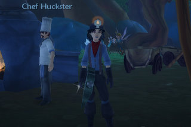

# A word to bloggers about reviewing MMOs I play.

*Posted by Tipa on 2009-05-07 07:36:30*

In the aftermath of the scandal surrounding Darkfall and its 2/10 Eurogamer review, I just have a couple of things to say.

You Darkfall players and those bloggers up in arms because they didn't play it sufficiently enough to get a good picture of the game? Listen up.

Are you the ones who write about EverQuest II that the starting areas are drab and some screenshot you saw a few years ago wasn't bright enough for you? Weren't able to figure out the skills or heroic opportunities and pronounced it broken? Wondered why I stuck with the game even though it clearly wasn't as good as WoW?

YOU FAIL. I don't go into WoW, play the first 20 levels and then pass judgment on the entire game. Don't come into EQ2 and futz around in the starting area and say the game is a massive pile of excrement. You CAN say the game doesn't appeal to you on your first impression, but that's ALL you can say.

By the way, I played WoW to 60 pre-BC, raided Molten Core, Onyxia, that instance in STV and a bunch of world bosses, and I don't have a thing to say about anything POST-BC because I never played it.

And those people who looked at Wizard 101 and maybe played around awhile in Wizard City and then wrote that you just seemed to play the same card again and again and the fights were too simple and you didn't like the open group scheme? Guess what?

Wizard City is a giant TUTORIAL. It's SUPPOSED to be easy. You don't start hitting the real meat of the game until Colossus Blvd because this is a game meant to be easy enough for kids to play. By the time you finish Marleybone, you'll have an idea of how complex and deep the game REALLY is. Don't think your experiences in the first ten levels qualify you to give a score to W101.

Last year, I challenged bloggers to pick a game and stick with it an entire year, because I felt at the time that that's how long it took to really appreciate all the complexity of an MMO. I chose Wizard 101 as my 'year' game. No matter how frustrated I got with the game, I stood by it and stuck with it. Clearly it didn't take a year to see and do everything, so maybe next time I take my own challenge, six months will be enough.

Wizard 101 may not be your kind of game, and that's totally legit. Nobody is going to stand around saying you have to like it. But until you've spent a hundred hours going through at least the first three worlds -- because Marleybone is a gem that should not be missed -- you don't know enough about the game to review it.

See, when you're a player, playing for fun, if a game isn't fun for you, you should find a game that IS. But when you're blogging about a game you haven't played much, all you can say is, "my own initial impressions based on the starting zone was...". If you insist that you are writing a REVIEW, then I better read how you liked the END GAME, because if you haven't even had as much experience with the game as the players who will read your article, where's your credibility?

I have not read even ONE true review of Wizard 101. It went into beta in July and live September and I have seen a lot of articles with "review" in the title, but none of the reviewers had ever leveled a character through Marleybone at the time of the article.

I have not written a Wizard 101 review, and I won't, because my review is in the articles I've written about leveling through the game.

Free Realms has been live for a week, and I've seen a bunch of reviews for the game that seem to be based mainly on the tutorial and playing a few minigames. Where are the articles about taking a balanced group into a three-pip dungeon? Where are the articles telling me the relative worth of the wizard or the archer for ranged dps? Is it better to start with a brawler or a ninja? How are the cash shop items? Which pet dog sniffs out the rare collections best? That's not part of your review?

Then HOW can you call it a review? You haven't even played the game yet?

So, people up in arms because of a perfunctory Darkfall review, remember this next time you see a review for a game where the reviewer clearly saw only a fraction of the content and an even smaller bit of the game play: They don't know what they're talking about. They are all lying when they call their article a "review" instead of a "first impressions". I expect the replacement Eurogamer "review" includes building a city and defending it from attackers, some sea battles would be good to cover, and what their death/kill ratio was in PvP. How can I expect any less from someone who is claiming to review Darkfall?

And here's a coda: MMOs aren't something you can ever write about without putting yourself in the article, because MMOs are as much about the community as the game itself, and if you aren't part of the community, then you aren't playing the full game. At least Eurogamer's reviewer admitted he hated Darkfall from the start. It would have been much worse if he had claimed to be neutral, but then let his hate for the very thought of the game seep into every word without admitting his bias.

