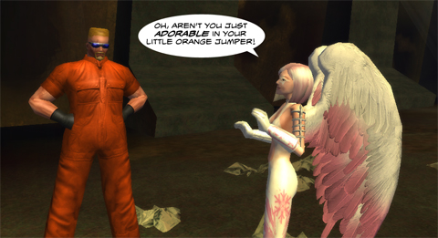

# Daily Blogroll 5/13 -- Going Rogue edition

*Posted by Tipa on 2009-05-13 07:27:25*

When I'm running around the mean streets of the Rogue Isles in City of Heroes, you know what I hate the most? Nah, not the dons of the Family. Not even Longbow. It's those damn tourists from Paragon City. And NOW I find that the heroes themselves are thinking about [slumming their dark sides on my turf](http://www.cityofheroes.com/goingrogue/)?

Sente hopes the expansion adds more depth to the Mission Architect, [allowing real choices](http://adingworld.wordpress.com/2009/05/12/city-of-rogues/) instead of "if it moves, kill it. If it doesn't move, harvest it." gameplay so common in CoX missions. Syp sees this as a necessary move to [separate the game](http://biobreak.wordpress.com/2009/05/12/city-of-roguecraft/) from Champions Online and DC Universe Online. Spinks wonders why it took so long for such a basic premise [as heroes and villains swapping sides](http://spinksville.wordpress.com/2009/05/12/new-expansion-for-city-of-heroo/) to make it into the game. Hudson hopes the expansion [will deal with City of Heroes' boredom factor](http://hudshideout.com/blog/?p=2478). 

I dunno anyone who actually pays attention to the plot for CoH missions. It's all about blowing stuff up. Really LOUD. Enemies are just something to target. Isn't it a cool coincidence that news of the new expansion has driven the discussion entirely away from player misuse of the Mission Architect?

Via [Runic Games Fansite](http://www.runicgamesfansite.com/2009/05/13/e3-fact-sheet-and-screenshots/), Perfect World will be at E3 and has [full details about the new games they are showcasing](http://www.perfectworld.com/e3_2009); MMO Jade Dynasty, MMO Ether Saga and Single Player Game/MMO to be Torchlight. Bunch of new screenshots, too.

Do you love World of Warcraft for the sense of exploration and meeting up with friends? Razakius tells the different story about a WoW where [mindless questing and emphasis on soloing](http://razakius.com/games/gaming/dislike-world-warcraft/) destroys both exploration and socialization. Ya know, whenever anyone disses WoW, I have just one thing to say: 12 million people from all over the world think WoW is the greatest MMO ever written, and are only dimly aware that there are other similar games (though they aren't as good as WoW because, hey, 12 million people can't be wrong).

Syp chimes in with all the reasons an emphasis on the soloer in an ostensibly multiplayer game is [a really good thing](http://biobreak.wordpress.com/2009/05/12/the-era-of-the-solo-mmorpger/). Well, yes, it used to drive me up the wall in EQ that my characters couldn't do much without a group, but, I grew bored with soloing on the characters that could. Maybe that's just me.

TERMINALLY bored. I just hate soloing.

Thom Terrazas introduced himself as [EverQuest's new Executive Producer](http://eqdev.wordpress.com/2009/05/12/hello-fellow-inhabitants-of-norrath/), replacing recently departed (for EQ3?) producer Clint Worley. Thom has a lot of history with EverQuest, and gives a really extensive resume of his time with SOE. Obvious by his omission is his previous gig as [producer of troubled MMO Vanguard: Saga of Heroes](http://www.massively.com/2009/02/06/vanguards-past-present-and-future-with-producer-thom-terrazas/). So the real question is... what does this mean for Vanguard? And is Thom going to be bringing the RMT focus to EQ that he oversaw in V:SoH?

Caliga at MMO Gamers [buys a castle in Wizard 101](http://mmogamers.freeblogit.com/2009/05/11/pull-up-a-chair-w101-housing/) and wonders why all these F2P games can have player housing while the industry giants like WoW and WAR cannot. Maybe, he muses, WAR doesn't have it because WoW doesn't have it, and if WoW doesn't have it, nobody wants it!

Ixobelle is making [individual graphic banners for the blogs in his blogroll](http://www.ixobelle.com/2009/05/now-with-more-ads.html), which I just think is really neat :) I should do something like that!

Spinks [looks back at a Year of WAR](http://spinksville.wordpress.com/2009/05/12/on-war/) and charts the rise and fall of her time in the game, as she lets her subscription expire. Though I never played Warhammer, [I did have my fun with the game](../../../index.php/category/mmos/war/straight-talk-warhammer/), and it's ALWAYS good to have MMO options. Mythic's only real misstep, I feel, was its unrealistic expectations for the game. There's no way it could have EVER lived up to its pre-release hype.

[Digital brand](http://dwellonit.taterunino.net/2009/05/12/why-i-havent-friended-you-in-facebook/) Tateru Nino only asks that Steam fulfill their part of the bargain and sell older games that work on new systems, as opposed to [old games that don't](http://dwellonit.taterunino.net/2009/05/12/letting-out-the-steam/). Now that Steam is hosting more and more MMOs, relying on them to keep their games up to date is a pretty pressing issue.

Green Armadillo of Player vs Developer wonders if the Lord of the Rings Online [Legendary Weapon system is so incredibly grindy](http://playervsdeveloper.blogspot.com/2009/05/800lb-content-gorilla-attacks-middle.html) so that Turbine is off the hook for more frequent content updates. Having to grind out thousands of mobs to make your shiny new weapon worth wielding? [Where have I heard THAT amazing idea before](http://www.thesafehouse.org/forums/showthread.php?t=20398)?

And finally, a bit of EQ2 news. Lars of MMOment of Zen writes that max level characters [will get more AA experience from combat](http://mmomentofzen.blogspot.com/2009/05/aa-xp-conversion.html) than before, making AA something you once again can gain just from doing your normal grouping and raiding. [Where have I heard THAT amazing idea before](http://eqplayers.station.sony.com/news_article.vm?id=50943&month=042008)? ;)

Keep gaming and have a great day!

