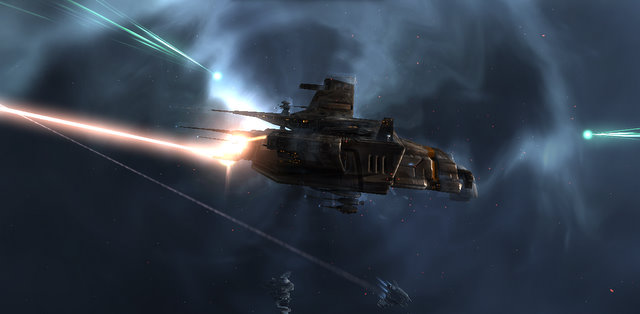

# EVE Online: PvP ops fallout

*Posted by Tipa on 2009-09-30 18:55:21*

Last night, a "rogue group" of us OtakuDyne types [headed to lowsec for some ratting fun](../../../index.php/2009/09/29/eve-online-first-pvp-ops/), and ended up going to nullsec to rat, and taking on some players we found. We killed our fellow ratters, and then their friends killed us. 

Was that all there was to it?

Nope, we'd kinda opened a playroom door and chucked a stink bomb in, then ran away to a closet to hide and snicker.

Turns out that we'd chosen a bad place to look for some casual PvP -- the Providence region, controlled by the powerful [Curatores Veritatis Alliance](http://cva-eve.org/) (CVA), an alliance with [a very long history](http://wiki.eveonline.com/wiki/Curatores_Veritatis_Alliance_%28Player_alliance%29) in the game.

As a result, [our corp was declared Kill On Sight](http://www.graffe.com/forums/showthread.php?t=65898) in Providence space. Providence is normally a safe area in 0.0 space, where you can transact business, mine or go ratting without fear. Unless you're us. Us, they will kill.

A corp director will be negotiating with CVA to get the KOS removed. Red has a couple replacement ships ready if they ask; I've donated ISK to help defray any other costs or conditions they might have.

A lot of people might say this was just a big clusterf**k and we were idiots and should be ashamed of what we did. Wrong. I'm happy, happy, happy, and I think the lesson we're being taught is a cheap one. I don't regret a thing, except that I got away with my ship. That seems somewhat unfair.

But as a result, a big alliance like CVA knows who we are. Clear this up and we can play in Providence, a place unknown to PvE'rs like ourselves. This ~~mistake~~ opportunity can open doors to new places and maybe we don't have to be a highsec corp forever because, much as I love EVE -- and I DO -- a diet of nothing but highsec could get dull. I'm not spending months training up to bigger and better ships just so I can grind what are essentially just quests. I'm spending months -- and hundreds of millions of ISK -- training up to bigger and better ships so that someday I can be in a big fleet flying off somewhere to meet up with another big fleet and contesting the ownership of a piece of sky.

So yeah. Yesterday I had never heard of CVA -- I'm still a noob to EVE in general and even more so to EVE nullsec politics. Now I not only know of them, I know their goals and purposes and what they're all about, been directed to a FFA PvP section of nullsec we can play in without angering any alliance, starting to learn about the geography of 0.0. Big smile on face time.

