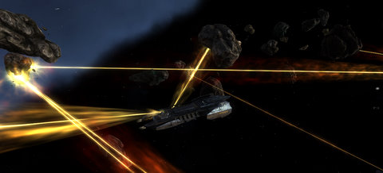

# EVE Online: I'm in Damallan Trick!

*Posted by Tipa on 2009-10-03 23:23:42*

**I'm in Damallan Trick**
(apologies to [LMFAO](http://www.youtube.com/watch?v=ysJyFAHwVP8))

When I warp onto the scene
Y'all know me by my miner
Like an oldschool forty-niner
I'm farming mats
I'm killing rats
I got some missiles and some drones in my hand
Hey you're looking cute in that Hulk-inator girrrrrl
Hey this is what I do I want to fill up that Hulk-inator girrrrl

Mine all day
Rat all night
Let's get refinin'
I'm in Damallan trick
Mish all day
Gank all night
Let's get a probin'
I'm in Damallan trick

I'm still not sure if LMFAO is a parody group or the real thing. The only reason I know this song is because it was one of the songs on [Tap Tap Revenge](http://www.youtube.com/watch?v=UsnJbIgl_qc) and by the time I got 100% on it, I'd memorized it :( Sad, I know.

Today was mining ops day because, heck, how many ships have I gone through in just the past week? Well, the corp lost a few ships in the Lowsec Ops, and then I lost my mission Myrmidon in Taru ...

[ Granola!")](../../../uploads/2009/10/ExeFile-2009-10-02-20-42-21-89.jpg)

Oh yeah. I guess I didn't tell this story yet. Now, I know a lot of people are going to tell me not to get baited into bad situations, but the only alternative was to sit there like a dork and take it, and I didn't feel like sitting there like a dork and taking it, no matter what the consequences.

Sometimes you just have to do what's right, no matter what. Here's the story.

As a poor Gallente girl lost in the galaxy, faction with far-away corps like Impetus is very rare and difficult. But Impetus will offer me the new epic mission arc if they like me so -- I've been doing stuff for them and building my standings. My travels brought me to the distant system of Taru, a Gallente outpost in the middle of Amarr and Caldari space -- enemies all around.

Eventually they gave me the mission [Intercept the Saboteurs](http://eve-survival.org/wikka.php?wakka=IntercepttheSaboteurs3am). This is NOT my favorite mission, and in fact I lost my first Myrmidon in this very mission as I got overwhelmed, webbed and warp-scrambled. So I was a little nervous because there's no real way NOT to get a dozen or so ships on you all at once.

I've skilled up quite a lot since then, and my second Myrmidon was VERY resistant to the thermal-based Amarr weaponry. So I was doing fairly well, drones doing most of the killing as I selected targets, tried to keep aggro from my drones, and kited as well as I could.

That's when I saw Flash Granola in his little bitsy cruiser come in to my mission. Great, a ninja salvager. But, no. He wasn't there for salvage. HE was there for the Amarr dogtags from dead Amarrs. (My tendency to spend my days and nights killing Amarrs is why I will never be accepted into a CVA corp. Dashed dreams.) The very first tag he looted turned him red.

He jokingly admitted in local chat that he was a thief, and he was going to follow behind me and loot my kills. Because what could I do?

Well, I could attack him. So I untargeted the Amarr NPCs and set my guns on him, drones too, and I started taking him down. Since I was not PvP equipped, I couldn't stop him from warping out.

I just wanted the mission done, so I told him he could have the stupid tags if he'd just stay out of my mission until I'd finished it. He agreed.

And then he shared the bookmark of my mission in local, so now anyone who cared could pop in.

Well, I wasn't happy. This was not an easy mission for me, and I just couldn't have people picking over my kills like that and I didn't know what to do. I did mention to my corp that if they were in the Taru area, they might want to slide on over. Nobody was, but Red and Mel started on their way anyway.

It wasn't long before someone else in a junk ship came into the mission and plucked a bit of loot from one of my wrecks, and turned red.

Okay. I KNOW I was being taunted. The passive-aggressive thing to do would have just been to park the mobs on me on his door and warp out. The smart thing to do would have been to just quit the mission and go do something else.

What I actually did was to turn my guns and drones on him, and he told me I'd just made a BIG mistake, and warped out.

He came back with a tech II ship and tore me to pieces.

So that was the end of the ironically-named "If You're So Smart".

I went and quit the mission, got out my salvager, and went back to look over the wreckage. Red and Mel arrived, but my nemesis had left, his point proven, which was -- just shut up and TAKE IT.

Nah.

Red promised to make me a new Myrmidon (which he did; and it's better than ever, since I finished a lot of new gunnery skills. WAY more dps and firing range. Named it "Death and Taxes".) When someone suggested a mining ops for this morning, I jumped at the chance, because, hey, gotta pay for those ships!

Everything is cleared up with CVA, by the way, and Cat's even installed a jump clone in a Providence station. He tells me there were pirates sighted in the system, though....

