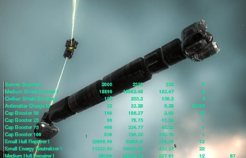

# EVE Online: Spreadsheet Power

*Posted by Tipa on 2009-10-11 10:22:18*

There's an item in EVE Online, dropped commonly by rats in missions, that can be reprocessed with minimal skills and its component minerals sold for twice the cost of that item on the market. In fact, you can buy unlimited quantities of that item ON the market, reprocess it, and immediately sell the minerals for competitive prices and make a 50% profit. For that matter, you can put a buy order out for as many of this item as you can afford for a competitive price, and people will SEEK YOU OUT to sell you this item.

This almost sounds like a scam, doesn't it? I made nearly 24 million ISK last night just from buying, reprocessing, and selling the minerals of this item and two others with similar ratios. As I ran a mission, my wallet would flash as person after person sought me out to give me their money.

Thanks to my spreadsheet. I went through my hangar last night, took the usual prices for each item from the market, then looked at the minerals I could get from reprocessing it and the values of those minerals on the market, put them all into a spreadsheet, sorted by profit et voila. I sold all those items that sold for more than they would be worth reprocessed, reprocessed the rest, put that on the market and made millions. I put in buy orders for those items with the best reprocessing potential, and this morning reprocessed the completed orders and sold those on the market.

Playing the market is a career path in EVE, with associated skills (I started working on those skills last night). Sitting in Orgrimmar with Auctioneer up is essentially the same thing, but what if, in WoW, you could train some skills that would let you pay fewer auction fees? Keep auctions up longer? Play on the Stormwind auction house?

You CAN train those kinds of things up in EVE.

People say about EVE, that it's more like playing a spreadsheet than a game. And? Someone with a spreadsheet crunched the numbers for all the stats in World of Warcraft to use as the basis of the mods everyone couldn't play the game without. Knowledge is power, and spreadsheets are just a tool to gather knowledge.

Someone in my corp said this all sounded like a huge waste of time. I'd made almost 13 million ISK in fifteen minutes when he said that -- that could take me a couple of mission hours.

Something else people say about EVE -- that it's just sitting around watching a mining laser slowly eat away at an asteroid for a million mind-numbing hours.

You can play the game that way if you want to. I did, when I first started. That's peasant work, though. At some point you just have to stand up and wonder what's beyond these dry fields of dirt and despair, and head out for the horizon. If you should trip over a spreadsheet along the way, is that so bad?

