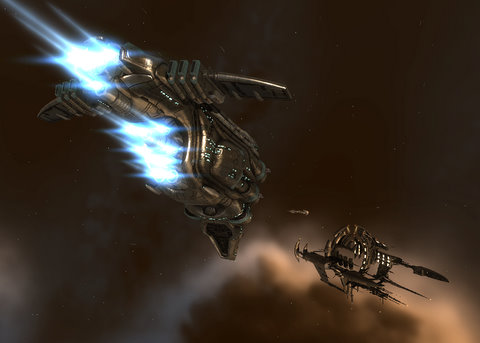

# EVE Online: It's Wabbit Season

*Posted by Tipa on 2009-11-04 07:01:39*

Reader Kinolyen pointed out, correctly, that running Minmatar missions wouldn't do much to improve my standings with Amarr and Caldari, who hate me. Since my standings for both are below -2.0, I can't get ANY missions for either faction, and both are just on the verge of sending bullets (of love, no doubt, in the Amarr case) at me whenever I accidentally fly through their space.

It felt really good, though, when in one of the Minmatar missions, I avenged the destruction of a Gallente station. By pirates!

Though my faction with Amarr and Caldari are beyond repairing directly, I did find on the EVE forums where someone said doing missions for factions allied to Amarr and Caldari could indirectly help those standings. So I flew off to Khanid space and started flying Level 1 missions, and just before bed last night, I'd raised standings enough for Level 2 missions. That meant either returning home for another ship -- a distance of 23 jumps there and 23 jumps back with portions of the trip in lowsec -- or just building a new ship out there.

I'd always wanted an excuse to build a Brutix. A pure dps battlecruiser with no room for a decent armor tank and not much chance to put up a fight with shields, either. But the loads and loads of high slots shows that this mean baby wants to get close and give you a hug full of neutrons. It's a PvP ship, and when I'm done raising standings, I'll be using this instead of my PvP Vexor for those kinds of ops.

I'm taking a little bit of a risk saying what section of space I'm flying, since we were all shocked last night to find that OtakuDyne has been wardec'd by the [Universal Peace Operation](http://killboard.eve-ivy.com/?a=corp_detail&crp_id=37095), a mercenary corp that gets hired to make war on other corps. Their corp info says they are friendly to CVA but [CVA says otherwise](http://www.cva-eve.org/kos/index.php). 

C'mon, did someone take offense at my digs against the Caldari yesterday and wardec my corp because of me? If so, that's really petty, but you can leave the rest of my corp alone and come get me in Khanid space, if that's the case.

Otherwise, nobody has a clue why we're wardec'd. The UPO diplo officer wasn't on last night, and the one UPO pilot who would talk to us wasn't initially aware that we were at war, but did explain about their mercenary status.

Red got a list of the names of most of UPO's 22 members so we can keep an eye out for them. I kinda feel, though, that I should head back down to Sinq Laison space and just be ready in case UPO starts harassing folks and we want to take a stand. Cassric has offered the aid of Holowan if the battle strays into their Providence home, and tonight IS nullsec ops night, so who knows. Maybe we'll get a decent battle or two out of this.

But dang, at least be decent and tell us why, k?

