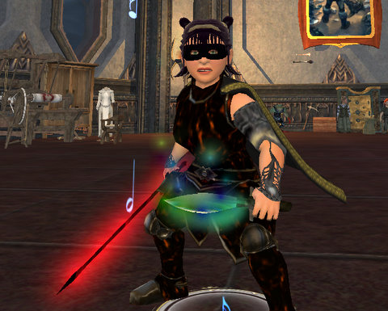

# EverQuest 2: The Sootfoot Experience.

*Posted by Tipa on 2009-04-01 23:57:42*

  
*Dina shows off the new Weapon Appearance slots and some Sootfoot Magma armor.*

If you want to make your own Sootfoot armor, you'll need to do every one of the Sootfoot quests, the Far Seas Trading Company quests, and have your mining and fishing both at 190 or better, AND be able to craft some low level items. Sootfoot Armor is Tier 5.

So it's a bit of a commitment out the gate, but hey, cool looking armor is worth it. Always!

This armor set is unique in that it comes with three sorts of shoulder armor and two kinds of pants, so it gives you some options. Here to show you some of them is today's model, straight from Big Bend, goes by the single name instantly recognized by any true citizen of Freeport, Rokseksi.

|  |  |  |
| --- | --- | --- |
| 
everquest2-2009-04-01-22-56-24-85
 | 
everquest2-2009-04-01-22-56-34-24
 | 
everquest2-2009-04-01-22-56-51-57 |

Rokseksi says about these outfits, "Dese be good armors. Dey burn. Dey burn so much. So you have tree smooshers, dey go woosh burn rite up, just like your hair go woosh it burn too. Pain good, though. Can cook gnome on hand, press down on him wit other hand so browned on da outside but still tender on da inside."

"Dey got three dese tings go near head but not on head, dey just kinda near it. Dey got da smooth one and dat you know you just kinda playing around wit da gnome but it not time for gnome to die just yet. Den dey got one for when you got to slice gnome up, you just whack him on dese, not have to wipe dem off like sword. Den dey got da flat one and dat good for break dem gnome hole doors like break coconut to get sweet milk inside but dere be gnome instead."

"So, dese things pretty dam hurtful but good for finding and cooking gnome."

