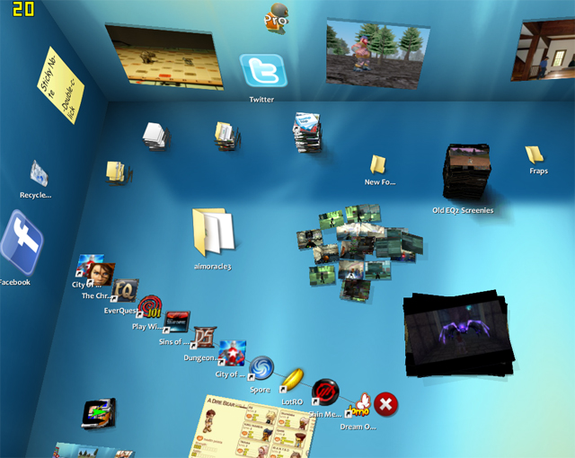

Back to: [West Karana](/posts/westkarana.md) > [2009](/posts/2009/westkarana.md) > [April](./westkarana.md)
# And then I tried... BumpTop

*Posted by Tipa on 2009-04-09 08:03:42*

A few years ago, there was this cool demo of a new desktop metaphor where your files were actual objects you could shove around, stack, fan out, pin to the sides and stuff.

Me, I am hardly ever looking at my desktop. Usually there's a game going on, or I'm working in Photoshop, or just browsing the web -- but I'm hardly ever just arranging icons on my desktop, and that seems to be all this program really did. To be honest, all I really need in a desktop is... hmm... launching programs that aren't used enough to make it into my Start menu, I guess. 

Anyway, it was finally released a couple of days ago, there's a [free demo version](http://bumptop.com), so I figured, why not?

And ... it's pretty cool at keeping my desktop icons organized. I told it about some picture folders I had, and it puts a slideshow of those folders up on the wall. I dumped a bunch of game screenshots onto the desktop and it organized them into neat piles. I put some frames from the comic I was working on there, and it looked cool.

I tried to drag stuff to the Twitter widget to automatically post it, but it insisted (wrongly) that I was giving it an incorrect user id or password, so that test didn't go smoothly.

It's a neat idea, but I wonder if it rises about merely a gimmick. The kind of stuff BumpTop does well, is not the kind of stuff I spend much time doing.

Anyway, judge for yourself -- video embedded below.

