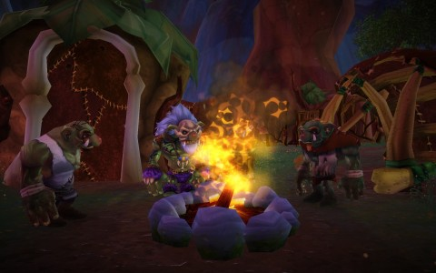

Back to: [West Karana](/posts/westkarana.md) > [2009](/posts/2009/westkarana.md) > [April](./westkarana.md)
# Very little about Free Realms closed beta

*Posted by Tipa on 2009-04-13 06:50:46*

The NDA prevents me from going into any detail at all about Free Realms, but [Massively](http://www.massively.com/) has more [Free Realms info](http://www.massively.com/category/free-realms) than you can read, so I don't really have to provide detail. I do have lots of screenies and reactions saved up, though.

My highest level job is five, so I can't claim to have seen much of the game, but what I have seen is amazingly high quality. The minigames are integrated well into the world (in much the same way I expect they will be in Gatheryn), and the adventure instances are funny and a lot of fun.

I've recently decided that what I like most in MMOs is exploring new places and dressing up my character to look cool. Free Realms scratches both those itches.

More details when I can :)

PS -- I do love the shoutouts to EQ2.

