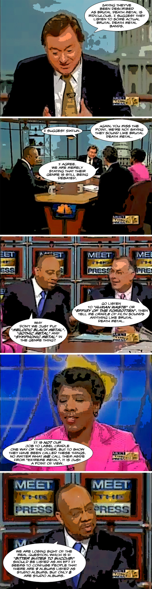

Back to: [West Karana](/posts/westkarana.md) > [2009](/posts/2009/westkarana.md) > [April](./westkarana.md)
# Meet the Press vs Cradle of Filth

*Posted by Tipa on 2009-04-21 23:18:39*

I can't write about the betas I am playing, so... more comics! Pictures from some Meet the Press I found on YouTube. Dialog from the [Wikipedia discussion page for Cradle of Filth](http://en.wikipedia.org/wiki/Talk:Cradle_of_Filth). 

## Comments!
---
**Ramon** writes: Haha, fantastic! :)\r\n\r\nWell, I do agree that CoF aren't very brutal :P\r\n\r\nMetal subgenres and sub-sub-subgenres are always a great source for ridiculous flamewars. I once made a <a href="http://www.youtube.com/watch?v=eg2BekIwkDg" rel="nofollow">misheard lyrics video for Amon Amarth's Fury Divine</a> and got flamed for calling them viking metal.\r\n\r\nCreepy.
---
**Tipa** writes: OMG That's HILARIOUS!\r\n\r\nVery funny :)
---
**Makkaio** writes: THAT was feckin' brilliant.  Made my day.
