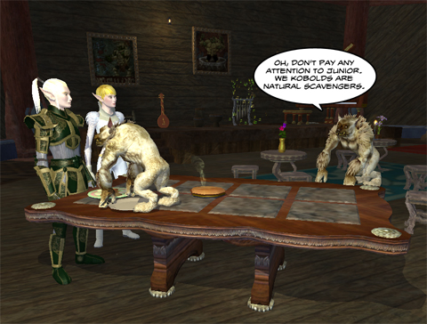

Back to: [West Karana](/posts/westkarana.md) > [2009](/posts/2009/westkarana.md) > [April](./westkarana.md)
# EQ2: But they said it was "All you can eat"!

*Posted by Tipa on 2009-04-23 23:05:42*

If you really wanted it all to yourselves, you shouldn't have ordered the Carrion Surprise.

## Comments!

---

**stargrace** writes: *twitch* New furniture.. *twitch*

---

**Tipa** writes: New furniture you CAN'T put in the GUILD HALL. Luckily, I had this wonderful dinner theater in my home that worked great, but still... why can't we put these nice things in the guild hall? Or is this how they are not competing with carpenters?

---

**West Karana » A little LotRO, a little Wizard 101 (Test)** writes: [...] « EQ2: But they said it was “All you can eat”! 24 04 2009 [...]

---

**stargrace** writes: I tried to search for a dev response as to why we can not put them in guild halls (and why are SC items not marked heirloom anyhow, I don't want to buy 20 sets of something!) but couldn't find one yet. LOTS of people were asking why they are not able to be placed in guild halls. Fingers crossed that it will change, but not holding my breath.

