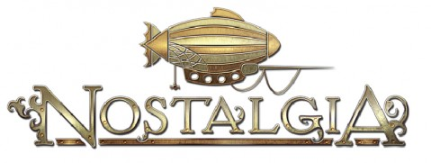

Back to: [West Karana](/posts/westkarana.md) > [2009](/posts/2009/westkarana.md) > [April](./westkarana.md)
# Nostalgia comes to the DS!

*Posted by Tipa on 2009-04-28 17:58:33*

My guild -- on the Nintendo DS?

Well, no, it's a Japanese RPG, though, with a pedigree that stretches back through some of the best JRPGs and anime ever written. Steampunk. Zeppelins. Customize your airship.

Even without the name, this would be a must buy. But WITH the name -- total WIN.

Kotaku has [a lot more about the game](http://kotaku.com/5231391/rpg-dream-team-delivers-steampunk-nostalgia-to-the-ds).

