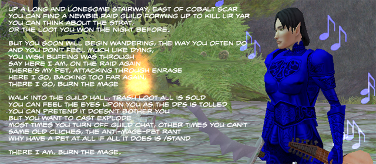

# Daily Blogroll 8/7 -- Band Camp edition

*Posted by Tipa on 2009-08-07 07:54:54*

Back in EverQuest, the raid leader had banned all mage pets because they tended to push bosses into walls. The mages were not amused.

Aion: Next WoW killer? Caliga thinks Aion might take that coveted #2 spot of ranked subscription-based MMOs right behind World of Warcraft with [a final tally of 800,000 players](http://mmogamers.freeblogit.com/2009/08/06/the-guessing-game-again-aion/). He's forgetting that WoW players always return to WoW. Always. My own prediction? 200,000 six months in because A) it's a WoW-like, and B) it isn't WoW.

The subscription-based MMO currently in that second position? According to XFire, [it's EVE Online](http://www.xfire.com/genre/mmo/massively_multiplayer_online/). New games aren't competing against WoW. They are competing against a game that is NOTHING like WoW. Will Aion lure people from EVE Online? I doubt it. But hey, maybe CCP will be taking their unique space game to ground with their [mysterious new Dust 514 game](http://www.rockpapershotgun.com/2009/08/05/ccp-trademark-and-dodgy-logo/)...

Werit, btw, re-subbed to WoW (but only for a month!) to check out the battleground xp added with the latest patch. Is it a good place to level? Werit concludes, [not so much](http://www.weritsblog.com/2009/08/wow-pvp-leveling.html). But will it get twinks off the BGs?

Mr. Anderson of Juxtaposed Life [wonders about Blizzard's priest math](http://www.xenopulse.com/blog/?p=687). If Healer A and Healer B are meant to be able to heal just as well, but Healer B can do it using only half the spells, and also tank, nuke, fly, breathe underwater and do dps, then just what is the advantage of playing Healer A again?

And [via the Ancient Gaming N00b](http://tagn.wordpress.com/2009/08/06/quitting-eternal-skirmish/), Lore Sjöberg’s generic MMO exit survey. They want you back. Really. [Unless you're a big macrame fan, anyway](http://badgods.com/quittinggame.html).

Is that enough WoW news? Let's move on.

Beau Turkey, sensing with his spider senses a gap in the world of gaming social networks with GAX Online's shuttering, [is thinking about starting one of his own](http://epicdolls.com/beauturkey/?p=1911), with moderation to deflect off topic posts. For me, Google Reader does a good enough job of collecting all the blog posts I want to read :)

Sean Emeraldweaver of Modern Automagic wants people to know [the difference between a noon and a n00b, Wizard 101-style](http://www.modernautomagic.com/2009/08/word-of-day-difference-between-n00b-and.html). (You're welcome, Sean!)

"[Second Skin: Losers in Basements](http://en.wikipedia.org/wiki/Second_Skin_%28film%29)" is available for your viewing pleasure at [SnagFilms](http://www.snagfilms.com/films/title/second_skin/) and [Hulu](http://www.hulu.com/watch/87648/second-skin) for this coming week. Am I being unfair to a film I haven't seen all the way through? 

I've only seen ten minutes of it so far, and it makes me feel awful about myself, so there you go.

*Added: I almost forgot until reminded by [Scopique](http://www.cedarstreet.net/) on [Twitter](http://twitter.com/Scopique): This is a Champions Online beta preview weekend! I'm eager to see how the game has improved since the last time I was able to play. I hope the servers stay up this time.*

