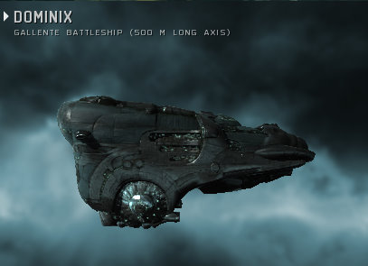

# Daily Blogroll 8/12 - Dominix edition

*Posted by Tipa on 2009-08-12 07:45:14*

EVE Online wants you to make money. It's hard NOT to be swimming in the stuff. So your given level 3 mission might have a couple dozen enemies in it. You get a bounty on every one you kill, they drop loot which can sell for a fair bit, can be salvaged for loot worth a million or more (sometimes much more) if you get a decent price, and many have asteroids that you can mine with very little danger that anyone will locate you. I've been sending my mining proceeds to one of the corp officers, and last night he parked a battleship at the local trading hub for me -- the mainstay of the Gallente Federation Navy, the Dominix drone tank battleship. Half a kilometer of hurt clad in a meter-thick skin of tritanium. Now I have to train for a few days to be able to fly it to my base in Aunia -- the EVE Online equivalent of bringing a new battery and a pair of jumper cables to check out a used car. (THANKS, RED!!!)

Spinks is of the opinion that not only are Achievement systems the latest and greatest evolution of the MMO genre, but [they are so wonderful](http://spinksville.wordpress.com/2009/08/12/achievements-for-non-achievers/) that even those people who really don't care about in-game achievements, now really do. No, seriously, even in my favorite MMO currently, Wizard 101, I don't bother grinding for the rare badges. I honestly don't care about achievements in MMOs, and I doubt I'm the only one. Achievements in EQ2 make me not want to log in.

The Ancient Gaming Noob [tosses out a line and drags back some wild guesses](http://tagn.wordpress.com/2009/08/11/the-approaching-cataclysm/) about WoW's (unconfirmed) next expansion, Cataclysm. Could WoW use the next expansion to revisit some of the older lands in new ways? Maybe. Guild halls and player housing? Hmmm.... maybe. But if they did it, there would be an achievement for papering the walls with mounted fish -- count on it.

Green Armadillo is back in the Lord of the Rings Online and [taking another look at the Mines of Moria](http://playervsdeveloper.blogspot.com/2009/08/more-early-re-impressions-of-moria.html) expansion. Forewarned is forearmed, he learns, with legendary weapons, and the long-abandoned, deadly mines of Khazad-Dum is now a bustling metropolis complete with invincible goats. But he's liking the increased challenge of the solo game.

Darren at Common Sense Gamer wonders if MMOs, in their headlong rush to make their games easier and more rewarding to new and casual players, [are abandoning precisely the things that made MMOs fun in the first place](http://commonsensegamer.com/?p=1435) -- challenge and depth. The sorts of things he's now finding in war gaming. Can this be true? Possibly -- even experienced game developers find themselves [confused by too many choices](http://www.wolfsheadonline.com/?p=2570) in their games. David Messer of the Wizard of Duke Street [didn't have much luck](http://dukestreet.org/archives/004713.html) with the plethora of choices in EQ2, either. 

Significantly, EQ2's variety was considered a selling point back at launch. This was before WoW lowered the bar on almost every element of MMO gaming to that point. Now WoW is the standard, and anything more difficult than WoW is -- just too hard.

I've been thinking about doing a Historical Daily Blogroll from 2001, back when EQ was the king of online gaming, and games like [Horizons](http://www.istaria.com/) and [Dawn](http://www.glitchless.com/dawn.html) (stop laughing, Dawn was gonna be [the EQ killer everyone was waiting for](http://www.sharkyforums.com/archive/index.php/t-105220.html)) were vying to make things harder and even more complex....

Ysharros of Stylish Corpse likes EQ2's crafting fine -- AFTER level 20. [Why does crafting from level 1-20 have to be so tedious](http://stylishcorpse.wordpress.com/2009/08/12/only-hurt-20-levels/)? (Seems to me that the levels 1-9 go by pretty fast, but maybe I just haven't done it lately).

Calming fears that Aion would be going the "subscription PLUS RMT" route that seems to be all the rage these days, RER of (Insert Awesome Aion Name Here) reports that [the Aion cash store would only be selling vanity items and character services](http://insert-awesome-aion-name.blogspot.com/2009/08/micro-transactions.html). (via [Aionic Thoughts](http://aionicthoughts.wordpress.com/2009/08/11/new-information-from-ayase-calms-my-worries/)).

WoW, eat your heart out. It's [shoulderpads for everyone](http://www.thenoobcomic.com/index.php?pos=357) at the Noob Comic. And Ben Kuchera at Ars Technica looks at how poorly designed games actually [push their players away from the computer](http://arstechnica.com/gaming/news/2009/08/why-we-quit-the-moments-that-push-us-away-from-gaming.ars).

And lastly, via Wandering Goblin -- [is your boyfriend a noob](http://www.wanderinggoblin.com/2009/08/11/n00b-boyfriend-disappoints/)?

