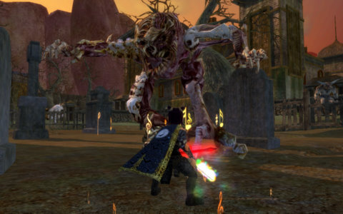
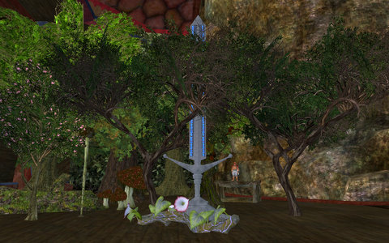
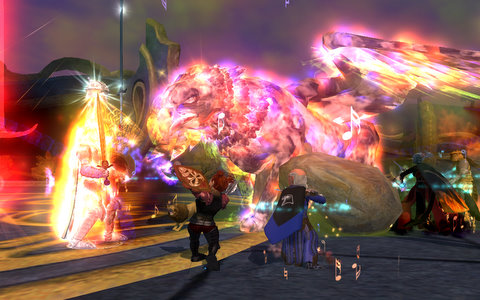

# EQ2: The Hero's Dream

*Posted by Tipa on 2009-12-01 08:07:53*

We were hacking a Serpentis radar site in EVE last night, and it was a good site, too. A bunch of Gallentean Starship Engineering datacores that will come in handy, a skill book that Toldain needed, and other stuff which is now cooking on the market... but Tranquility shut down to prepare for the Dominion expansion going live today, so I headed to EQ2 for some fun.

And I actually got a group!

I started out the night with a quick Chronomagic daily quest, which last night was the Ancient's Table in the Pillar of Flame. I've always liked "Ancients" for the great experience -- I made a couple of levels on my troubadour in an afternoon there. It was also a little bit dull; you just go in there and kill everything until the boss spawns. I think at one point there was a time limit to ensure the Ancient Cyclops would spawn, but now, maybe just clearing the zone is enough.

Dera and I used Chronomagic to mentor down to level 70, enough to turn the quest green but not too low that we couldn't finish it. Troubadours are not the world's best tanks. Someday I'm going to have to try it with Dera tanking....

That done, I swapped Dera for defiler Etha and set out to do the EQ2 fifth anniversary event, the Hero's Dream, on its last day. Not much to it; you talk to some people in North Freeport, and are sent to awaken a man who has fallen into a magical sleep. The wizards attending him warn that any who touch the man themselves fall into a slumber from which they never wake, but we heroes are made of sterner stuff, and so we enter the man's dream.

He wants us to gather the broken shards of his soul from various dreams -- the Tower of the Moon from Desert of Flame; the Halls of Fate from Kingdom of the Sky; Karnor's Castle from Rise of Kunark; The Estate of Unrest from Echoes of Faydwer; and the Palace of Ferg'zhul from The Shadow Odyssey. All retuned for the solo player, and none too challenging for the troubadour, but the defiler was having trouble pushing out enough dps to make it worthwhile.

At the end, Thumore D'armer was set free, with hints that we may know of him in another form. Knowing the EQ devs love of anagrams, it doesn't take much letter fiddling to guess that Thumore was actually Morell-Thule, the Lord of Dreams, so I imagine we'll be seeing more of him fairly soon. In our dreams, at least.

And he gave a really cool statue of the Qeynos Claymore, which I placed directly in the middle of my scale model of Archer's Wood :)

Though it was late, there was a group looking for a healer for the Shard of Love! I logged Dera in and asked for an invite. When I got it, I admitted that I didn't have my mythical (not even my fabled epic!). They laughed :) It felt good not to be immediately judged on my lack of gear. The Shadow Odyssey expansion so often seems like all the bad parts of WoW's achiever mentality infecting my favorite game and driving away all the casual people.

We flew through the instance, met Mithaniel Marr, watched him greave over his sister once more. It was a lot of fun. It's nights like that that remind me of everything I love about EQ2. But I know that if I ever went so far as to look for a group as an 80 inquisitor -- or an 80 troubadour -- I'd only get abuse for my lack of AAs and high end weapons and armor. I don't expect this to get any better with the next expansion.

Tonight -- back to EVE to check out Dominion.

