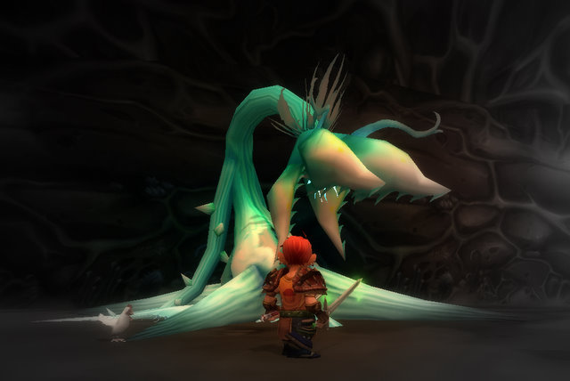
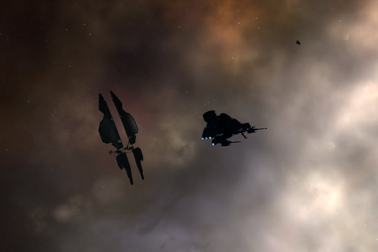
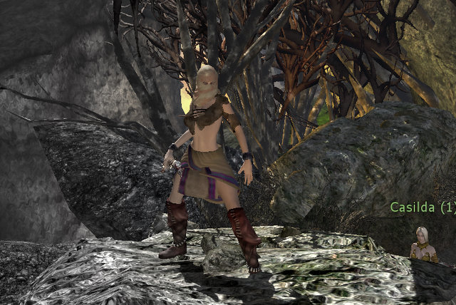
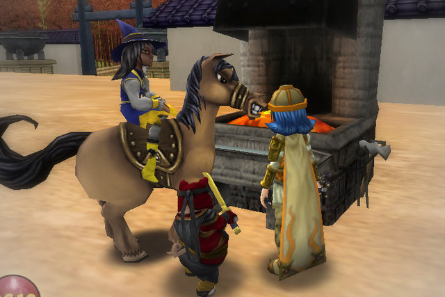

# Weekend Gaming: WoW, AoC, EVE, W101 et al

*Posted by Tipa on 2009-12-21 01:05:41*

I just love this picture, I don't know why! I think it might be the best picture I've ever taken in the World of Warcraft. It's the dead boss at the end of the Orange Crystal part of Maraudon. I've been to the Orange Crystal side about a half dozen times now; Purple Crystal once. I think I've outgrown Uldaman now, I never get offered it any more. We just started with Zul'Farrak tonight.

Azeroth Advisor had pointed me toward the quests for Zul'Farrak and to a lesser extent, Maraudon. It's freaky. I level, Azeroth Advisor sends me a newsletter, and then WoW starts sending me to those places with the Looking For Dungeon tool.

I started out a week and a half ago at level 31 going through Razorfen. Then Scarlet Monastery (Library, Armory, Cathedral), Uldaman, now ZF and Maraudon. Sunken Temple has just got to be on the horizon. Level 44 now; at this rate, I'll be making the buy/no buy decision on Burning Crusade in a couple of weeks. Just in time to decide if I'm going to take WoW past a month.

I'm still not decided, but it is good, casual fun. It seems to take forever to get anything going in EQ2. In WoW, I press a button, start working on some quests, and then at some point it rings and I'm poisoning my blades for a dungeon run.

The limited edition Zephyr probe ships are indeed friends to the Sleepers. There was a wormhole in Aunia. I scanned it down, looked around for the first Sleeper nest I could get to, and then shadowed those implacable aliens on their patrols. It occurred to me that a Sleeper nest is really the best possible hiding place for wormhole exploration -- anyone would hesitate before following a probe shuttle into that sort of headache.

I closed up my shop in Mandoo and headed back to Sinq Laison space. I did enjoy my stay in the Kador region, but it was never intended to be forever. I have my CreoDron agents busily researching Gallente Starship Engineering and Electronic Engineering datacores, but the best agents for Mechanical Engineering datacores are not with CreoDron at all; Duvolle are the mechanics on this side of the galaxy. They have an agent willing to work in Mies, not far from Aunia, but I have to build up standings just a little before they will work for me.

Most of the time, though, I've been working on the market, scanning down and clearing plexes, and waiting for invention training to complete. I'm a little burned out on straight missioning; I'm really trying to make my money in the market, but as usually the case in EVE, always more skills needed to do it well.

Age of Conan is having a promotion where if you download a trial version of the game that gives you the first twenty levels, you never have to pay. Not unless you want to step outside the tutorial zone of Tortage, anyway. Funcom is very much hoping you will, as is Mythic with Warhammer's similar promotion (and so is KingsIsle, which has been doing this same thing since launch with Wizard101).

The graphics in Age of Conan are simply incredible. The animation is smooth and fluid, the combos are a joy to watch... The equipment doesn't look that great, but this is supposed to be a shipwrecked slave with amnesia, so fashion isn't a priority at this point.

And just a by the way, how many games have you start off with amnesia as a thin plot device to have an excuse to have thw rodl you presumably grew up in explained to you? All the way back to Planescape: Torment at least. EQ2 started off doing that, AoC does it, Aion does it... The heroes of story and legend are powerful, mighty, brave, bold -- and really susceptible to a good rap on the noggin.

In AoC, the moment you wash up on shore, having been rescued by divine intervention (which looks pretty creepy neat, btw -- very well done), a NPC runs up and before he checks to see if you are well, explains exactly where you are. As if upon meeting someone new, the very first thing you do is tell them which country they live in, which countries are around it, which legendary nations may exist beneath the sea, and the gross national product of all these nations to the closest million for the previous calendar year.

You are also given a handy guidebook which explains how to do other things you may have forgotten, like walk (although evidently, you have the sort of amnesia where you forget how to move around, but not how to read a book).

Moving on ....

Even with the reactive combat -- where you must always strike to the weak spots -- combat isn't significantly different from other games in the broad genre, like WoW or EQ2. You spam your abilities and wait for cooldowns. That many or all your attacks are effectively AE does make taking down the inevitable groups of mobs more of a joy.

Age of Conan does an excellent job of putting you in its world, the mark of great storytellers at work. The unfortunate reality is that to experience the story, you must do a long list of cookie-cutter quests (go to the quarry and bring three blocks! Kill ten of these! Etc!).

I took my first "night" mission -- night missions are solo quests -- and talked to an old lady who prophesied a great destiny for me, la la la la la.

AoC looks great, its combat at least attempts to be a little different, but I could not get past the entirely standard quest lines. I played an assassin, which may have been a mistake -- it's the kind of class that plays identically in any fantasy game. I may try some of the other classes, the unique ones especially. It's free, after all!

I took a few days off of Wizard101 after finishing Grizzleheim up last week. This weekend, I continued on with the Moo Shu quest lines. I started work on road to the Death Oni, the longest and most difficult of the Moo Shu quests. I'm probably about halfway done with it, with the Village of Sorrow quests to finish, and then the Tree of Life and its mysteries.

I'd have finished it, but the fifth straight quest of "Kill 10 of this monster" just sent me to distraction. Dragonspyre is just as bad, and I have to wonder if all this work just to have to level 50 characters for Celestia is worth slogging through MS and DS again.

Well, yes it is -- a little at a time. The core gameplay is still fun, but the game is suffering these days from being overly familiar. Sure, it's a fun card game, but it's a year and a half old now; what else do you have? Rather than extend W101 forever, I'd like to see what else KingsIsle has up their sleeves. I can't get excited about a new expansion where now you have a dozen quests where you have to kill FIFTEEN of every monster, and every battle takes an hour.

Still love the game, though. I have just been playing it a very long time.

I also played the beta of a hotly anticipated MMO. It is looking VERY good. I can't wait until I can talk about it plainly.

