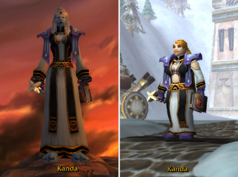
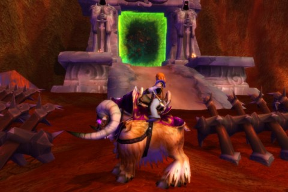
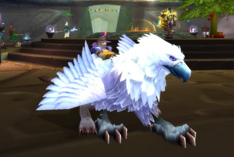

Back to: [West Karana](/posts/westkarana.md) > [2009](/posts/2009/westkarana.md) > [December](./westkarana.md)
# WoW: Behind the Green Door

*Posted by Tipa on 2009-12-29 07:55:06*

While leveling Tipa the Gnome Rogue through WoW's classic dungeons, it was brought home to me again and again how my poor level of twinkitude was hurting my standings in random groups. Even though I read lots of WoW Rogue guides on setting my talent spec and what sort of ability rotation to use, and even though my average dps has risen from 65 to 175 in the past few days, in groups I am not often a top performer. Sometimes half the group is doubling my dps. They have amazing looking weapons and armor with shoulders up to HERE.

If only I had a level 80 character able to buy twink gear in Dalaran, just like all my ~~friends~~ ~~random groupmates~~ weird armory-page-reading jerks who make characters on your server to taunt you about how they, as a tank, ran into a group of mobs and left the party, teleporting them out of the dungeon, leaving the rogue who had been following behind to assist to die. Yes, he made a character on my server to tell me how "pwnt" I was and to wish me good luck on my corpse run. I complimented him on his mastery of WoW speak; half the things he said I couldn't understand, but I got the whole "pwnt" part.

I lost my train of thought for a moment; sorry.

A few months back, Blizzard began offering faction changes; Horde to Alliance, Alliance to Horde, a perfect transfer. Worked out a lot better than those back-alley faction changes goblins would do to hapless Hordies in Gadgetzan. I'm sorry, but there's no way a shaved Tauren with their horns lopped will ever pass as a gnome. Stormwind guards are still going to know them by the stink.

But divine intervention can work. I have a character higher level than Tipa; my old Horde priest. Once she reached level 60 in those pre-BC days, I really had nothing to do but grind faction and deal with raid guild stress, neither of which were really appealing. When drama killed my second raid guild, I decided the game had nothing more to offer me that was fun, and I quit.

A faction change would bring my troll priest over to the Alliance side, where she could get into the good bits of Burning Crusade and feed twink gear to me.

The process was incredibly easy; $30 gives your character a little icon on the character select screen. You have all the time you need to prepare for the move. I grabbed my epic mount from the raptor mount vendor, and took all the enchantment essences I'd gotten from disenchanting dungeon loot, hit the icon and -- changed race. I could have chosen from human, night elf and I think draenai, but finally went with dwarf.

I was hoping I'd keep the epic raptor mount, but it morphed into a giant ram. I picked up Burning Crusade as well, changed from Holy/Disc to Shadow spec, and headed to the Blasted Lands to find out what was Behind the Green Door.

Pro tip: there's actually portals to the Blasted Lands in all major cities; don't have to keep taking that long bird ride. The mage guilds in Stormwind and Ironforge have them.

Here's another pro-tip: If you hang around the battle scene just on the other side of the portal too long taking screenshots, epic-level mobs WILL kill you, and your corpse WILL NOT be easy to recover.

I spent a lot of those early hours in BC learning to play a shadow priest and also not die. I'd always seem to find myself trapped in places surrounded by orcs or demons who all had a real problem with me killing their friends. But I had to do it; everyone had told me that I would completely replace my gear with gear tons better my first couple of hours in BC.

They weren't lying -- I got a lot of upgrades (which looked HIDEOUS), but my dps was barely double that of my rogue. It should be a Lot More. I joined a BRD run as a dps just to get a feel for the competition. I was the lowest on the dps chart. The random dungeons for my level were all orange and red dungeons in Burning Crusade. Without having all the upgrades and probably level 70, trying to heal in those dungeons would be murder, and as dps, ineffective. Until I come up with 1000 gold, I won't be able to dual spec, so stuck soloing quests as a shadow priest for now, my least favorite thing to do in a MMO.

There are compensations. Selling some of those essences netted enough gold to buy the beginner flying mount, and it is FUN. Flying quests in Burning Crusade is pretty darn fun, actually. Love those bombing runs. Sure, its like an 80s arcade game, but that doesn't bother me. I abandoned the quest grind for awhile and just went soaring all around the expansion, looking at the sites. Nobody does huge, stunning vistas like Blizzard.

I have a choice to just drop Tipa and work with Kanda (the priest) until she can afford the dual spec and has sufficient gear to be a valuable member of a Burning Crusade group, or focus on the rogue who has yet to hit the BC upgrade grind. I have been mostly going with the rogue. She's halfway through 51, though, and it won't be long before both my characters will be facing the grind to 70. I know I'm only going to do it for one of them. I have no idea which I'm going to choose.

