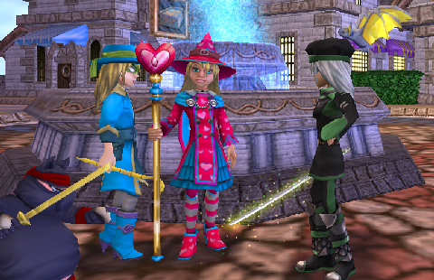
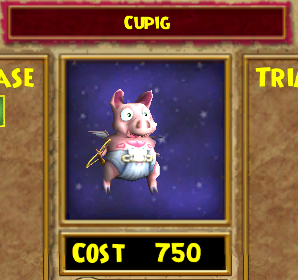
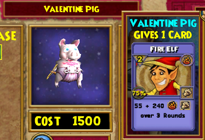
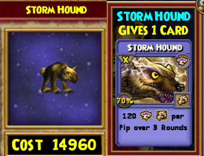
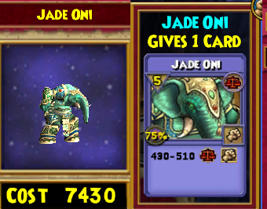
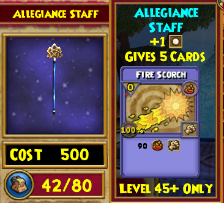
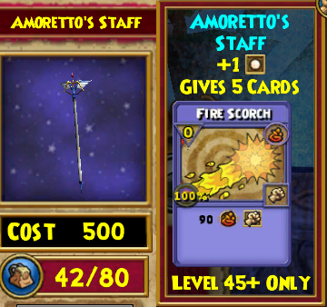
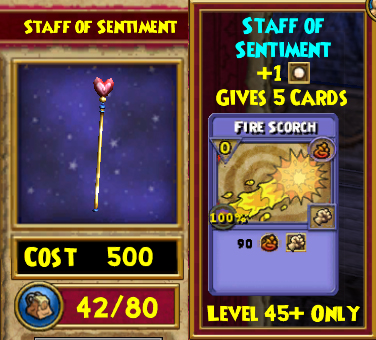
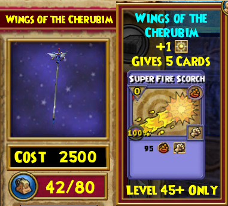

# Wizard 101: This ain't the Summer of Love

*Posted by Tipa on 2009-02-09 08:51:54*

Um, sorry for the Blue Oyster Cult shout out.

Scratch that. I'm not sorry. Blue Oyster Cult RULES. And there ain't no angels above. Cuz things aren't like they used to be. And this ain't the summer of love...

Um, sorry. This post isn't about my favorite band. This is about Wizard 101's newest heartthrob, Valentina Heartsong.

> Valentina: "Hi! I'm Valentina! I'm standing on this street corner holding a huge staff with a heart on the top of it, trying to find some love, and everyone keeps on taking it the wrong way! PLUS, what's with all these GIRLS? Aren't there any BOY wizards?"

Tara: "Your eyes... they are so... deep and... pink..."

Random girl in Marleybone clothes: "I need to touch your hair. No wait, I need to run my toes through your hair... Grrrmmmmmm...."

*Cough* sorry. Valentina has this season's latest and greatest Crown items. Crown items, you'll recall, are bought with Crowns, and they are purchased with money. So how much do you want these items?

Valentina is the first of the Crown merchants who isn't selling clothing. That's a good move for her, as the clothing her brothers and sisters sold had no stats and so could not actually be worn. I'd have preferred that KingsIsle had added appearance slots so that the clothes you show could be different from the clothes that actually gave you stats, but at least saving people from spending real money on useless items is a good move.

She sells two pets. Both are re-skins of the common flying pig you can buy from Wizard City's pet vendor in the Shopping District. The first is just the Valentine-themed pig. The second is slightly darker, and adds a Fire Elf card to your hand. Even at higher levels, Fire Elf is a good way for Fire wizards (or those using Fire magic) to keep the enemies from casting annoying Fire shields to block your mega attacks. So if you have the crowns -- go to the pig who comes with an elf. All I'm saying.

As long as we're talking about pets, let's take a brief trip to Dragonspyre, where Zeke has a couple of new pets to sell. Note that you'll either need access to Dragonspyre yourself, or have a friend who can bring you, to buy these pets. Once you are there, though, there's no level requirement to buy or use these pets.

This Storm Hound is more or less an "I Win!" button for Storm wizards. It's as powerful as you want it to be -- cast it at one pip and it does 120 damage over three rounds. Cast it with four pips, as a high level Storm wizard would start many fights with, and it's 480 points over three rounds, which is pretty darn nice for a spell you can cast first round AND keeps those pesky Storm shields off. This is the most expensive Crown item in the game -- but for Storm wizards, it is so amazingly powerful that it would be hard NOT to buy it. I hope other schools of magic get similarly overpowered items, as this could be severely unbalancing in PvP, where Storm wizards already hold a real advantage.

Zeke's other pet is Jade Oni. You might think that, being a Moo Shu Life boss, that the Jade Oni pet would give a Life card. You would be wrong. Instead, Jade Oni just does a balance strike which is cool, I guess, but dammit. I'm a Life wizard, I want my Life pets to cast Life spells. Anyway, go go Balance wizards. I might purchase this just because, hey, Jade Oni.

Then again, as far as status items go, purchased pets are pretty low. It's the rare drop pets that you want to show, the rarer the better. My Storm Bat is never far from my shoulder.

Okay, back to Valentina, who has been waiting patiently all this time. She has more than just pigs in her pack; she's also brought a huge selection of fire wands with her. New with her are wands of different levels. Now we can buy wands that actually will be useful for our level.

Wands have many uses. Damage is one use, but as time goes on, it's not what you really look to them for. Removing your damage and accuracy debuffs, building up pips or removing enemy damage shields -- these are the bread and butter for wands. The level 40+ wands also can add extra pips to the beginning of a battle to get you fighting faster. That's the thing older Crown wands didn't supply -- but these do.

I'm just showing the level 45+ wands here, but there is a similar selection for wizards of every level.

Allegiance Staff, 500 Crowns, adds a regular pip to the beginning of a fight.

Amoretto's Staff, 500 Crowns, again with a regular pip.

Staff of Sentiment, 500 Crowns, yet again, just a regular pip. I do love the heart at the top :)

Wings of the Cherubim, 2500 Crowns, adds a power pip to the beginning of the fight. This is the one you want if you can get it; a power pip at the beginning of a fight is like 1-2 free pip-building rounds in a battle.

There's some pretty decent Crown gear coming for Valentine's Day, and it's clear KingsIsle gets that the Crown items must not only be attractive, but useful as well.

Now, when are appearance slots coming?

