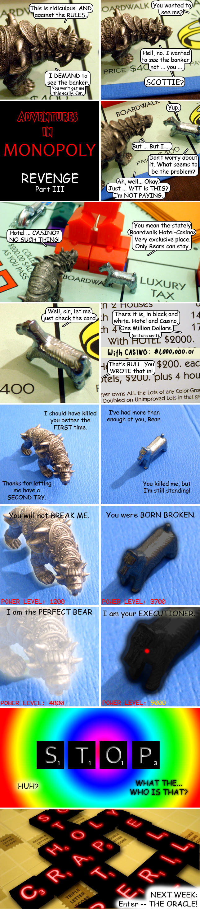

Back to: [West Karana](/posts/westkarana.md) > [2009](/posts/2009/westkarana.md) > [February](./westkarana.md)
# Adventures in Monopoly: Revenge, Part III

*Posted by Tipa on 2009-02-16 01:26:47*

In last week's episode of Adventures in Monopoly, Scottie made his way back from the Old European Monopoly set over a vast cardboard ocean in the hold of a Lego pirate ship. To the shock and amazement of his friends, though, he appeared healthy and very much alive, though he had been killed during Bear's coup d'etat. Scottie was reluctant to say much until he heard Bear complaining about something in the distance. And then Scottie became very much interested.

## Comments!

---

**Saylah** writes: Amazing - you with this story is absolutely amazing. Great stuff! I can't wait to see who/what the oracle is in this motif.

---

**TheRemedy** writes: AKA The All Knowing Scrabboracle!

---

**Yitu** writes: Great Comic :)

Regards from Germany,

Yitu

---

**Tipa** writes: Thanks all :)

You're gonna love next week's (I hope!)

---

**Toldain** writes: Shouldn't that be power level OVER 9000?

---

**Tipa** writes: That's IMPOSSIBLE!

You're right, of course :)

