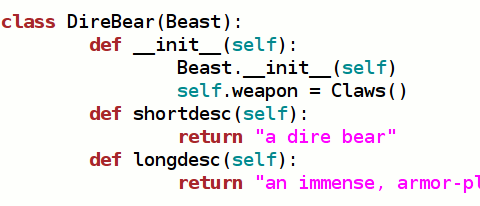

Back to: [West Karana](/posts/westkarana.md) > [2009](/posts/2009/westkarana.md) > [February](./westkarana.md)
# #bearraid, version 0.0

*Posted by Tipa on 2009-02-20 08:37:56*

I was just sitting around, waiting for a spot on the Trakanon raid to open, and I got to thinking, hmm... I should write that Twitter-based RPG I've been talking about.

So last night and this morning, that's what I did. Players can enter the game and whack on a mob until one of them dies.

Doesn't sound like a lot of fun, and it isn't, but right now, it's all about getting the basics done, get something working -- anything, really -- as quickly as possible, so I can see how to move things forward. All about the iterative game programming style, right? Make it fun, then add new stuff, make it fun some more, etc.

And re: the code snip above -- no, I am not planning on making every mob and weapon an individual class. This is just getting things going quickly.

You can follow progress on Twitter by searching on #bearraid, or following @direbear. Beware of occasional spam, though I will be working on the game offline for awhile now that I know the basic Twitter connection is working.

Yes, Bear is taking on the additional duties of emceeing this game in the downtime of his Adventures in Monopoly gig.

## Comments!
---
**Tipa** writes: Was thinking on the way in that there will have to be a browser-based component for equipping your character, trading items, setting actions, buying healing potions... Twitter would just be used to mediate the multiplayer battle portion. Maybe the web component could show a graphical replay of the battle, though that would take a lot of artwork and a lot of coding, so that's nothing to worry about yet. Still, would boost the "fun" factor.\r\n\r\nAbility to purchase more action and reaction slots.\r\nTo encourage specialization, requirement to have bought unlocking tomes which depend upon earlier knowledge -- typical skill tree, in essence. You can be a master at something or have some skill at many things. Or you can grind a lot to become super.\r\n\r\nAction points regenerate between fights, but health does not. Drinking health potions is a potential reaction ability. Usually will buy a health potion between fights or get someone to heal you in a fight. Probably most people will have a basic heal at their command.\r\n\r\nIf you run out of action points, all you can do is autoattack or flee. Every specific action or reaction used takes one or more action points.\r\n\r\nReactions include parry, block, evade, fly, shield, heal, self-rez. Reactions are automatic based on battle conditions.\r\n\r\nActions include disarm, slice, heal, blast, etc. Actions are automatic based on criteria the player sets.\r\n\r\nPlayer doesn't have to autoattack at all, but why wouldn't they?\r\n\r\nIf you are dead when the mob dies, you get no reward. If you flee, you get some xp (or gold) based on your contribution, but no loot. It is better to flee than to die without a heal or rez. Best is winning, which gets loot + xp/gold.\r\n\r\nCurrently mob attacks at random from its aggro list. I will want to weight this by amount of aggro, but everyone will have some chance of being attacked if they have done anything threatening. Hostile mobs will give some aggro to everyone in the battle even if they have done nothing. Peaceful mobs won't.\r\n\r\nAll mobs will have a rare, more powerful variant with better loot, gold, xp, unique items.\r\n\r\nWeapons and armor can potentially grant actions and reactions.
---
**Ysharros** writes: I can has vorpal sword? :D
---
**Tipa** writes: @Ysharros -- ugh. Lessee. Need to have concept of whether or not a creature has a head. Cutting off a head would be a good "action" move attached to a sword, but it would seem overpowered. Maybe only allow it to do the vorpal move once, then it either breaks or no longer gives the vorpal action. Maybe make it a "burned out vorpal sword". Using a vorpal sword successfully against a hydra would cut off ALL the heads at once. And every single neck would sprout two heads, so you wouldn't want to use it there.\r\n\r\nOr maybe it only works vs Jabberwocks :)
---
**mbp** writes: Given bear's history can we assume that this game will have a decidedly hard core pvp slant?
---
**Malekith (Caffo)** writes: Tipa, I've been thinking about this idea, and 've outlined the follow structure:\r\n\r\n- No character creation (first participation creates the character).\r\n- Character level defines how many actions they have per turn (level 1 == one action, etc).\r\n- Actions are listed in the webpage, and are level restricted (just players level 5+ would be able to fireball) or have requisites (group heal requires level 2 in lesser heal).\r\n- Each time a character uses a action, he got XP for that specific action\r\n- No classes.\r\n- Each time the Bear/Dragon/UberRaidTarget dies, everyone who succesfully attacked get some XP and Loot.\r\n- If the character died, he get proportional XP, but no loot.\r\n- Dead characters are ressurected after the end of the current raid.\r\n- The bot would announce the deadline over twitter ("5 minutes left until the pull, send your actions").\r\n- After the combat turn, each player would get a twitter direct message listing happened with his character. A HTML page would be generated too, with he entire combat log.\r\n- If the Bear/Dragon/UberRaidTarget dies, all characters loot / XP are granted to the characters, and levelup messages are sent to the players (and announced by the bot as public tweets).\r\n- The countdown to the next turn (or battle) starts.\r\n\r\nWhat you think?
---
**Tipa** writes: @Malekith those are some pretty cool ideas.\r\n\r\nNo character creation -- I agree, but then I worry about people just making bot armies. Maybe they could play the first scenario, then would have to register somehow? At least slow down the bots.\r\n\r\n1 action per level -- this game will be pretty non-interactive; actions will be triggered somehow, depending on the action. I think. I was considering have people purchase action slots with gold dropped in-game. One slot free, two slots affordable, three pricey, four more or less out of reach. How many action points is something I'd probably want to do the same way.\r\n\r\nActions have prereqs -- totally agree. People could be as general as they like, but they can specialize if they want.\r\n\r\nXP for actions -- well, about that. Just spamming heal on someone who doesn't need it shouldn't give xp. I'm not actually sure what will trigger xp, but having a positive influence on the fight would be key. Again, what we're mostly doing is programming bots because Twitter is a poor platform for time-dependent games.\r\n\r\nNo classes. Agreed. Well. The specific actions and reactions chosen will imply a class if you think about it. But it will be possible to slot other actions and become something else.\r\n\r\nEveryone attacks gets something -- definitely. But what of the person who enters the fight near the end, pokes once -- how much should they get?\r\n\r\nDeath gets xp? No. I want the bravery/flee system to be used. I want there to be a difficult choice to leave a battle you might lose, or stay in hopes the RNG grants a miracle. If you always get a cookie live or die, people will never have that decision. Also, I want someone who specializes in healing to have an important role -- don't let people be dead!\r\n\r\nBot announcements? Definitely.\r\n\r\nDirect message after every turn? Nah, that would be spammy. But after it is done, that would be useful.\r\n\r\nPost-battle messages? Should we be announcing to everyone else what loot someone gets? Nowadays its common, but EQ never told anyone, not at the beginning. Opened some real trust issues which made people have to learn to trust who they were with. Loot is definitely something I don't have any good ideas on yet. Any help with how to distribute it, and even what to distribute, is despersately needed.\r\n\r\nCountdown to next battle -- that's the way it is now, but I'm not certain battles should happen without people ready to play. It would be nice if someone could just read the Twitter search and see only real battles in the history...\r\n\r\nWow, you sure brought up some very good thoughts, Malekith... I'll be looking forward to seeing what you think of the next iteration!
