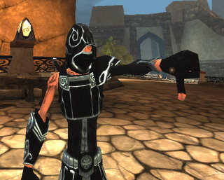

Back to: [West Karana](/posts/westkarana.md) > [2009](/posts/2009/westkarana.md) > [February](./westkarana.md)
# Out of work? Home sick? Wanna talk about Spellborn?

*Posted by Tipa on 2009-02-26 20:10:56*

**Breaking news! Acclaim CEO Howard Marks says Chronicles of Spellborn closed beta starts NEXT WEEK!**
======================================================================================================

I'd love to talk about Spellborn. I've been a big fan of it for a couple years now, wrote about it at every opportunity at Massively, even had the collector's box set shipped from Germany and leveled up chars on the EU servers because I REALLY LOVE THIS GAME. Cue creepy "[I'm your number one fan](http://www.youtube.com/watch?v=t5xehYVnsnY)" music...

So when I heard Acclaim was going to have a chat about the NA version of Spellborn, part of me went YAY! Then I found out it was going to be at noon (PST). On a weekday. When I, and probably most likely players, would be at work. So. Bah. Epic fail.

I just want to play!

Acclaim's announcement after the break. Complaints about the time can be brought to Acclaim's "Acclaim Sucks?" room. (Oh, yes. Acclaim Community Manager 'Historian' saith: "Was inspired by user ret2121 who created 2 rooms 'acclaim sucks' and 'Acclaim Sucks!!'. Seemed like a good way to get feedback.")

Hi, We’re going to have our first Spellborn Community Chat on Friday Feb 27th, at Noon (Pacific time).

David Perry the USA Game Director, and El Dryver, the Lead Game Designer will be on the call.

This chat will be held on Voon, http://voon.vivox.com in the “Acclaim Spellborn” Room.

Voon is a free client that lets you join into group conversations.

Once you’re in Voon, Double-click the event in the “Events” window
-or-
Click the "Rooms" tab, Click "Manage", and then "Join a Room.."

The name starts with "Acclaim" then click find.

They will be in the "Acclaim Spellborn" room.

If you plan to ask questions, please enable the “Push to Talk” feature.

See you there,

David Perry
Acclaim Games, Inc. 
