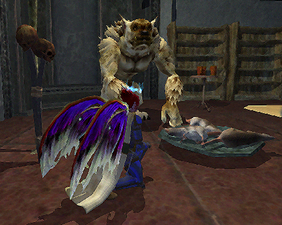

Back to: [West Karana](/posts/westkarana.md) > [2009](/posts/2009/westkarana.md) > [February](./westkarana.md)
# EQ2: Hooded Justice never looked so sweet

*Posted by Tipa on 2009-02-27 08:00:22*

Back in, oh, I guess this would be the early 90s, I had a friend who was so excited about finally putting all her paintings -- 'paintings' -- on this new World Wide Web thing. I'd known she liked art, but painting? I didn't know she did that.

She sent everyone in our little circle of friends links to her paintings page. And it was all, every single one, pictures of her filtered through some oil painting setting of some early paint program.

Oooh, Van Gogh must have been turning in his grave. This was quite a long time ago, but even so, I'm pretty sure old Vincent was dead by then.

Anyway, I present this new PAINTING by me, which I PAINTED, and in no way is a screenshot run through a Photoshop filter.

  
*"Feeding Time", ca 2009, acrylics on canvas (not Photoshop)*

The huggable kobold there is one of two new 'house items' added to the Station Marketplace RMT store recently. The other one is a stern looking high elf. Yeah. Can you imagine trying to sleep with some ELF looking at you? Brrrr. The kobold only cost 100 Sonybucks, and every account had gotten 150 when all this started, so I bought the kobold and set him up in my room in the guild hall. Then Kasul fed him a platter of dead rats. THOSE didn't last very long.

|
 everquest2-2009-02-27-06-58-56-43*Helm of the Good Ship Lollipop*
 | 
everquest2-2009-02-27-06-59-12-97*Helm of Mom's Silk Pillowcase*
 | 
everquest2-2009-02-27-06-59-57-94*Armor of My Corpse Is Safety Green*
 |

There's also two new hats in the Marketplace and a full set of Ranger armor. Not so excited about the Love Boat hat, but mostly because you have to shave your head bald to wear it. She HAS NO HAIR beneath that hat! It's a look that says, "Hi! There's lunch on the Lido Deck at 3, followed immediately by the New Tunaria Fascism League annual awards ceremony!"

The middle helm, though -- I am getting SO CLOSE to spending money in the RMT store, and in fact, this helm might just push me over the edge. I wonder, is this stuff marked with the HEIRLOOM tag? Because if I could share this stuff between the characters on my account, it would be a done deal.

The last is a full set of ranger-looking armor. If they make this in black, I might go for it.

|
 
 everquest2-2009-02-26-22-42-33-30
 | 
everquest2-2009-02-27-08-31-12-20
 | |

There was some discussion in the guild hall last night about the executioner's hood. I said Fae look cute in EVERYTHING. Kasul said I couldn't find a way to make a Fae look cute in that hood. A few minutes with the broker, and I think she looks cute.

But really, the prize has to go to the halfling males. This hood was MADE for them. Made JUST FOR THEM!

