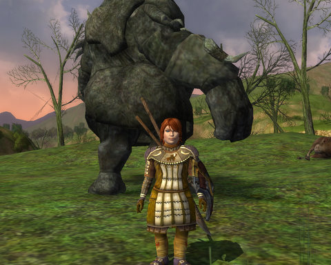
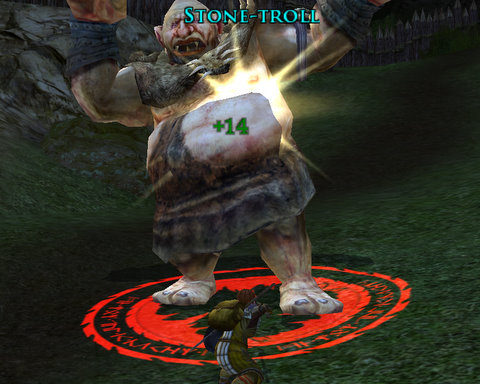
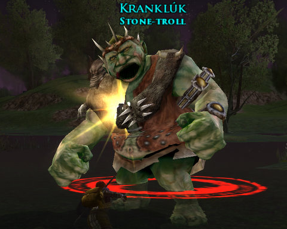
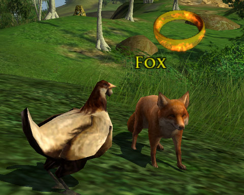

Back to: [West Karana](/posts/westkarana.md) > [2009](/posts/2009/westkarana.md) > [January](./westkarana.md)
# Lord of the Rings Online: Hobbit vs Troll

*Posted by Tipa on 2009-01-19 13:57:00*

If Bilbo could see me now, why, he'd be talking about how he (with maybe a very little help from a certain gray-robed wizard) kept three trolls arguing until morning light turned them all to stone. He wouldn't approve of what I do at all, why, not one little bit. "Un-Hobbit-like!" he'd yell. "It's just not how things are DONE!" he'd exclaim. "Even the Old Took would think twice! And then twice more! And then have a good smoke about it!"

Me, I'm a modern Hobbit. When I see a troll, I don't run and hide or try to reason with it. I don't fret about my crops and fields or worry what Sam's Gaffer might be muttering about me over his ale at the Green Dragon. I crouch. I aim. I throw. I leap.

I'm a Warden of the Shire. Why are there no trolls in the Shire? It's not because the climate isn't right, or their migration paths have shifted to the North, or they have suddenly decided Elves are tastier.

It's because I kill them all.

I was stunned by how familiar Lord of the Rings Online still is, even after all this time. I played the game a few weeks before it went live and a month afterward, and since they let people from the open beta take their characters live, I have all my beta characters. Some are still at the level 15 beta cap, some further advanced. I've been taking my old main, Lysistra, a level 33 Captain, on little tours of Middle Earth to get reacquainted with the world, but mostly she has been farming materials for crafting, and doing some crafting. All my old crafters -- Dera, the Metalsmith; Eraindiel, the Weaponsmith; Dina, the Jeweler; and Lysistra, the Tailor -- have been woken up in order to start producing gear for anyone who wants. I chose Historian as Ettie's crafting profession. This gives her the Scholar and Farming professions, as well as Weaponsmith.

I switched Ettie to Historian when I took a look at the Auction House and found absolutely nothing I could afford for dyes. There were very, very few on the market and almost all of them sold for far more than 100 silver.

Mudflation has clearly taken hold in LotRO. When I played before, the Auction House had plenty of items for characters of all levels, a nice selection, but now even the first thing a crafter might make to skill up is being sold on the Auction House for many, many times more than it's worth. The items that are actually useful -- skillup items are useless, but every tier of crafting can make things better than most drops, and rarely, better than any drop. The prices for THOSE items, nobody can afford. Since the recipes for those items are uncommon drops, and for the best things, extremely rare (and one use only). New crafters are unlikely to be able to make these things for themselves.

My original plan was just to play around with alts until I got familiar enough with the game to pick up where I left off with Lysistra, in North Downs, on the brink of traveling to Evendil (or whatever it's called. It's well known that Elves are just as confused as Hobbits about Elvish place-names).

With good friends thinking about starting new characters, I started a new one as well. After some waffling about who would play what, I elected to go with one of the new classes, the Warden. Wardens are your basic commando class. They sneak around, find their target, build power for a devastating javelin shot that stuns the enemy, then leap out and follow that up with a devastating hit. Past that, they build gambits from their base attacks that add effects like bleed, heals, taunts, knock-downs and such to their regular strikes. Very similar to the EverQuest II rogue classes, including the ability to tank fairly well. They even get a >200 point IN-combat health regeneration buff.

I wasn't surprised to see many fellow Wardens running around the newbie fields.

I reached level 15 Sunday, and am just on the edge of starting Book 1, Chapter 1 of the epic quest. That will have to wait, though, a few days for people to catch up. The whole point of playing with friends is to do the fun things, like the Epic quest, together.

The game hasn't sat still for the past two years. The Chicken-play quests are sometimes hilarious as they send you off to the edges of Middle Earth as a level 1, eminently edible chicken, dodging high level monsters with such devastating chicken attacks as Possum Impersonation, Bob & Weave and Paranoia. There's appearance armor (Ettie in the first picture is wearing some. Well, in all the pictures, but it's hard to see in the others). There is player housing, which is pretty much continuously sold to players from level 10 onward, even though its price is way beyond the means of most new players. Combine the cost of a home with the cost to furnish it and make the payments, and you're talking a really deep money-sink. I would hope that there is a faster way to travel to these homes, because they are WAY out of the way. If my home in EQ2 was so far away that it would take a good portion of a play session to even get to it, well, I doubt I'd visit much.

Travel in LotRO is still EXTREMELY slow, in keeping with the lore. The people who give the quests, though, think nothing about sending you all over the place. Running so slowly. Wardens get a run speed buff, another of the cornucopia of talents that Turbine has showered on the new class, but even with that running... S-L-O-W. Plus, the game still stresses my computer as much as it did two years ago. Bree is still an exciting slide show.

A crafter from a really friendly Kinship was sending weapons to people Saturday; I got a spear which, at level 10, was FAR better than any other weapon I'd found before or since. I sent them a gushing thank you note because, what an incredibly kind thing to do! Why would a Kinship even care at all about random guildless low level characters? Especially someone playing a Flavor-of-the-Month class such as Warden?

This time through the newbie area makes all the old adventures come back. I remember exactly what the grind from here on is like. The terrible, endless killing in Midgewater Marsh and Lone Lands and North Downs. The trilogy of terror that drove so many people from the game, and drove me from it as well. The horrible, horrible grind that is crafting, requiring exponentially more materials every tier for less and less progress (and each tier must be done twice!).

LotRO was the game that enshrined the grind. Maybe playing with friends can ease the pain.

