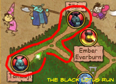
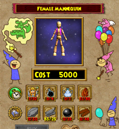

Back to: [West Karana](/posts/westkarana.md) > [2009](/posts/2009/westkarana.md) > [July](./westkarana.md)
# Wizard 101: Why crafting is broken, and how to fix it

*Posted by Tipa on 2009-07-07 00:40:39*

With the Grizzleheim expansion, KingsIsle also brought crafting to the world of Wizard 101. The crafting system chosen is the most ... um ... unique(?) ... that I've seen in any MMO.

Crafting in the real world was once the domain of skilled artisans who devoted years to learning their craft, and then spent the rest of their careers making items of art and utility for their customers. A good craftsman's name was known far and wide, but every village had a smith, and larger towns and cities would have entire quarters set aside for the crafting trades.

By and large, MMOs have used the idea of a skilled artisan earning a living by selling the items they make as the basis for their crafting systems. Becoming a skilled crafter was so expensive and time-consuming in EverQuest that those who chose to take on a trade or two were highly prized by their guilds. WoW simplified crafting, as it did so much else, so that everyone had a trade, but getting the best and rarest recipes required significant effort so that once again, the best crafters were a rare commodity. EverQuest 2 started out considering crafters a separate but equal career path to adventuring.

What binds them all is the notion of a crafter who, with great effort, is able to use their artisan skills for the benefit of their friends and guild, or just to hawk as a service to others or a means of income. In most MMOs, after spending time and money learning their craft, an artisan can earn a good return on that later.

Wizard 101 looks at things differently. 

**Harvesting**

Most WoW-like MMOs require crafters to harvest raw materials from the world, and here, Wizard 101 is no exception. Harvesting nodes spawn here and there throughout the world. W101 crafting requires so MANY resources, though, that a given zone doesn't have enough active harvesting nodes to support even one crafter. Instead, the most efficient means of harvesting resources is to find an area with several node spawns, then flip between the different servers harvesting where you can. This might seem like a hack, but it's impossible to gather the necessary items for free otherwise.

While the first crafting "badge" isn't too onerous, all later ones require hours spent flipping realms and running a route. I spent the better part of a day running the same circle in Moo Shu for enough items to complete the first of the Moo Shu crafting quests.

I don't feel this is appropriate for a kid's game, but it's not out of line with the effort required for other games, since there are no skill-ups for W101 crafting, just earning badges (analagous to levels).

But here's where W101 takes an exciting turn toward the bizarre.

**Crafting Slots**

In order to prevent crafters from being overly productive, every crafted item uses up a crafter's ability to make another item for anywhere from 15 minutes to 60 HOURS or more. Earning new crafting badges earns you more crafting slots; working on the second half of my initiate crafter badge, I have three slots available, all of which are working off twelve hour cool-downs.

Cool-downs punish crafters by making it impossible for a crafter to make things to order. But that was already never going to happen because ...

**You can't trade money or items to other people**

People love the new mannequins, which let you show off your best outfits in your home. Any Apprentice Crafter or above can make these, but they take vast amounts of very, very rare harvests, so it's unlikely to be something I make casually, especially if someone doesn't have the materials. But even if someone DOES have the materials, they can't give them to me (and I couldn't give them the mannequin) because there is no item trading in the game -- just Treasure Cards -- special, single-use cards.

The only possible way to get an item from one player to another is via the Bazaar.

**The Bizarre Bazaar.**

The Bazaar also came along with Grizzleheim. It's not really a bazaar in any traditional sense; it's more or less an NPC store where the stock is sold to it by players for a fixed amount, and bought for a fixed amount.

The first thing you'll notice about the Bazaar is that it is filled to the very top with trash items. From Wizard City through to Dragonspyre, most items awarded from battles are trash, never used, only sold for their cash value. (And helpfully, the vast majority of the equipment you can make by crafting also falls into this category, making it likely most recipes in the game will never be made by anyone, ever).

So for me to make your mannequin for you, you would have to sell your rare components to the Bazaar, I would have to buy them back (at a higher price) to make the mannequin, then put the mannequin on the Bazaar and hope you bought it before someone else did. All very risky, and with a significant chance of loss. (And a certain chance of being out lots and lots of gold for the privilege of making an item for someone else.)

The 5000 gold recipe for a mannequin, by the way, can only be used seven times.

Crafting in Wizard 101 is not any fun at all. Zero. Neither harvesting or the crafting experience itself provides the slightest bit of enjoyment, not even the satisfaction of making something useful for a friend, since even that is impossible. Having to buy three crafting stations (you get a fourth for making the very basic items for free) to make items is pointless, since you are only at them for an instant, unlike EQ2, where crafting stations have their own animations and the crafter is actively using them during the entire process of crafting (which ranges from a few seconds to a couple of minutes for hard to craft items).

**Fixing crafting**

Here's my suggestions for fixing Wizard 101's crafting.

2. Get rid of crafting slots. Instead, make crafting take a set amount of time spent at the crafting station, like WoW, EQ2, LotRO, DAoC, Aion, etc etc etc. Having crafting cooldowns of 59+ hours for some items is just ... weird.

4. Let people trade items between each other, or at least implement something like EQ2's "commission" system, where two people can join the crafting process. One provides the skill, and the other the materials (and gets the item).

6. Remove trash crafted gear. The selling point of having equipment strong in two schools loses its lustre when the items so made would seriously gimp the wearer. Case in point: Flaming Cloak of the Tomb, recipe sold by a Death school recipe vendor in The Necropolis. +1% Death accuracy, +10% Death damage, +6% Fire damage, no health, no mana, no card, nothing -- a robe no death wizard in Dragonspyre would EVER wear, for any reason, having gotten superior robes probably in Wizard City.

8. Remove trash loot from the Bazaar so it is possible to find worthwhile items.

10. Remove trash loot from the game. It just overflows backpack space and gets into the bank and overflows that as well, causing people to miss out on items of actual value because trash loot choked up all available space. Just give the gold instead.

12. Allow players to sell their crafted items for prices they set. Make it worthwhile to be a crafter.

14. Add appearance slots, so crafters can make equipment of unique appearance for wizards to wear over their battle gear.

Crafting, currently, is a money and time sink. Its only real use, thus far, is to make unique housing items (which I have done), but those taking amazing amounts of resources and aren't likely to keep up interest in crafting as a past-time. It needs a huge overhaul to be at all useful, and in its current form, I very much doubt many people will take up crafting to make items at considerable expense for no reason.

