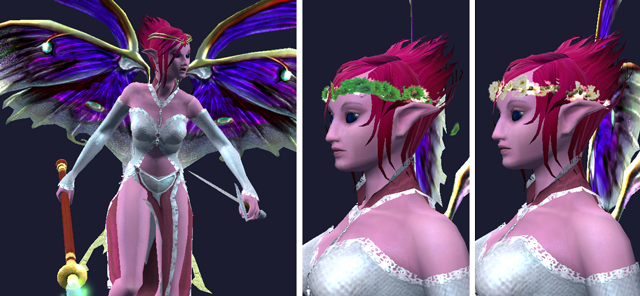

Back to: [West Karana](/posts/westkarana.md) > [2009](/posts/2009/westkarana.md) > [July](./westkarana.md)
# EQ2 Fashion Show: Metal Gear and Tramp Wear

*Posted by Tipa on 2009-07-07 07:02:35*

Wow, it's been awhile since I did an EQ2 fashion post. But, ahead of my (soon to be) triumphant return to the game in a big way -- waiting on the new character transfer service to carry my characters to a new home on Antonia Bayle server -- it's time to start getting things ready for the trip.

I really hope that Antonia Bayle server will be a more relaxed, casual experience than my current home, Najena. I was goofing off last night, listening to channels, and it sounds like T2 TSO armor PLUS mythical weapon is the baseline for TSO groups now. My main, Dina, has T1 TSO + Kunark raid armor (and her mythical), but my cleric? Her armor is just RoK group armor -- and no fabled, much less a mythical weapon. My goal is to get Dina her T2 armor, and to get Dera (cleric) T1 armor + Fabled epic.

|  |  |
| --- | --- |
|
 EverQuest2 2009-07-06 22-03-44-23 |

 EverQuest2 2009-07-06 22-09-50-37 |

Dina won't need to look like the newb she is with the Station Marketplace's new BLACKENED VANGUARD ARMOR. Now, even the lowliest bard can look like a [BAMF](http://www.urbandictionary.com/define.php?term=B.A.M.F.) with this armor made from polished shards of the purest night. Look at how happy Bear is to bear (sorry) such a deadly haffer.

Good stuff. First RMT armor I've bought, because it's just SO COOL.

Brightknife went right for the more feminine section of the Marketplace store. First up: Firiona Vie's scepter and tiara. Apparently, Firiona Vie thinks she's the mascot for EverQuest II. Brzzzat! WRONG! Firiona is *EverQuest's* tame floozy! Antonia Bayle is EverQuest II's tramptacular booth babe.

The scepter is the first "appearance only" weapon offered by the Station Marketplace -- it cannot be wielded as a regular weapon.

The other two pictures are of the Circlet of Mums and the Circlet of Daisies -- both pleasant looking, but hard to see against a character's hair.

But back to the old Firiona vs Antonia fight. They are BOTH PALADINS, right? Why do they go around dressed in harem outfits? If memory serves, when Firiona went about in the world of Norrath, she was dressed in plate armor. But on the boxes -- you have Firiona Vie in [a bondage position being threatened by a lizard](http://www.mobygames.com/game/everquest-the-ruins-of-kunark/cover-art/gameCoverId,14301/) on the Rise of Kunark box; Firiona Vie knee deep in snow [dressed in nothing but veils and goosebumps](http://www.mobygames.com/game/windows/everquest-the-scars-of-velious/cover-art/gameCoverId,14299/) on the Velious box... seriously, wouldn't you have more respect for both Firiona Vie and her sister in slutitude, Antonia Bayle, if they dressed the part?

|  |  |
| --- | --- |
|
 Firiona Vie in EverQuest. Note the plate armor and sword.
 | 
Firiona Vie as she might look in EQ2
 |

Fact is, teenage boys are just going to play WoW anyway, so there's no need to splatter softcore on the game boxes, and to SOE's credit, they've largely stopped doing so.

